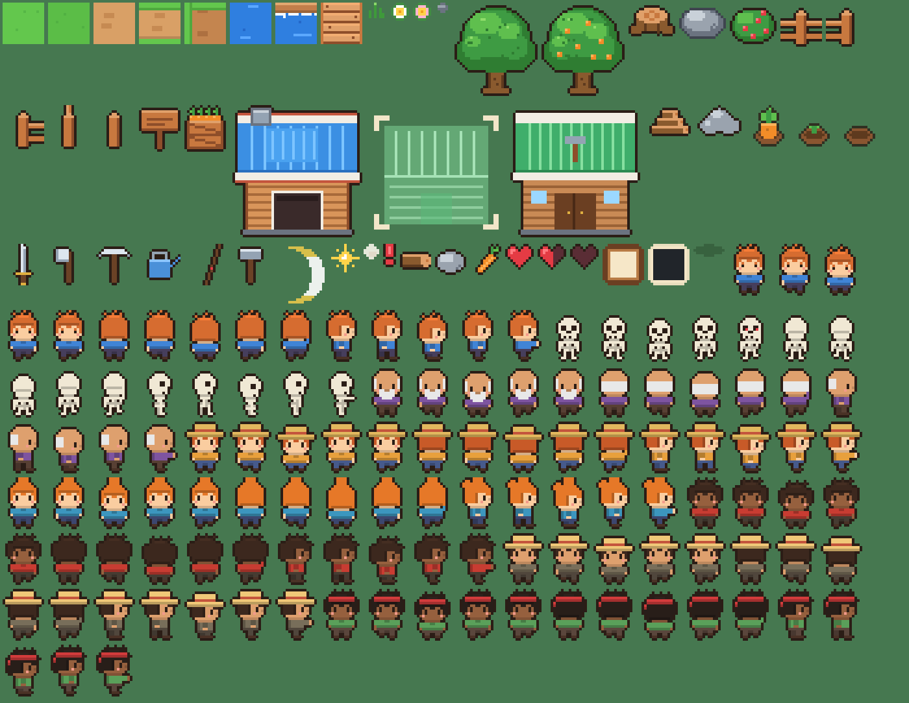

# 에셋 교체 가이드

현재 모든 그래픽·사운드는 코드로 생성되는 **임시 에셋**입니다. 정식 에셋은 파일 이름 규칙만 맞춰 넣으면
코드 수정 없이 교체됩니다.

## 스프라이트

`SpriteLibrary.Get(key)`는 먼저 `Assets/Resources/Art/{key}`(Sprite로 임포트된 PNG)를 찾고, 없을 때만 임시 스프라이트를 생성합니다.

- 임포트 설정: Texture Type = **Sprite (2D and UI)**, Pixels Per Unit = **16**, Filter Mode = **Point**, Compression = **None**.
  히트 플래시(흰색 깜빡임)를 쓰려면 **Read/Write Enabled** 도 켜 주세요.
- 피벗: 캐릭터·나무·울타리 등 서 있는 물체는 **발밑(하단 중앙)**, 타일은 중앙.
- 현재 임시 스프라이트를 PNG로 뽑아 밑그림으로 쓰려면: 메뉴 **dotRPG ▸ Art ▸ Export Placeholder Sprites** → `Assets/ArtExport/`
  (이 폴더는 Resources가 아니므로 게임에 영향이 없습니다. 다듬은 파일을 `Resources/Art/`로 옮기세요.)

| 분류 | 키 |
|---|---|
| 타일 | `tile_grass_{0,1}`, `tile_dirt_{mask}_{0-2}`, `tile_soil_{mask}_{0-2}`, `tile_water_{0-3}`, `tile_water_edge_{0-3}`, `tile_dock` — mask: 1=북 2=동 4=남 8=서 쪽이 잔디와 맞닿음 |
| 장식 | `deco_tuft`, `deco_flower_{0,1}`, `deco_pebble` |
| 사물 | `tree`, `tree_fruit`, `stump`, `rock`, `bush`, `fence_{mask}`(1=좌 2=우 4=위 8=아래 연결), `sign`, `crate`, `house`, `site_blueprint`, `site_built`, `pile_wood`, `pile_stone`, `crop_carrot`, `crop_sprout`, `crop_hole` |
| 캐릭터 | `char_{lookId}_{down,up,side}_{idle0,idle1,walk0-3,attack,hurt}` — lookId: `player`, `skeleton`, `chief`, `farmer`, `fisher`, `builder`, `lumberjack`, `miner`, `carrier`, `kid`. `side`는 오른쪽을 보는 그림(왼쪽은 자동 반전) |
| 도구 | `tool_sword`, `tool_axe`, `tool_pickaxe`, `tool_can`, `tool_rod`, `tool_hammer`, `tool_crate` (위를 향하고 손잡이가 피벗) |
| 효과 | `fx_slash`(오른쪽을 향한 호), `fx_sparkle`, `fx_dust`, `fx_leaf`, `fx_chip`, `fx_bone`, `fx_water`, `fx_alert`, `shadow` |
| UI | `icon_wood`, `icon_stone`, `icon_carrot`, `heart_full`, `heart_half`, `heart_empty`, `ui_panel`, `ui_dark`, `ui_select`(9-slice, 테두리 설정 필요), `ui_white` |

전체 목록은 `ProceduralArt.AllKeys()`에 있습니다.

## 사운드

`AudioManager`는 `Assets/Resources/Audio/{key}` 오디오 클립을 먼저 찾습니다.

`swing, hit, hurt, player_down, enemy_windup, enemy_attack, enemy_die, chop, mine, tree_fall, rock_break, pickup, pluck, heal, blip, select, confirm, cancel, deliver, hammer, build_complete, quest, ending, music_title, music_village`

## 폰트

`Assets/Resources/Fonts/UIFont.ttf`(또는 .otf)를 넣으면 모든 UI에 사용됩니다. 없으면 OS 한글 폰트(맑은 고딕 / Apple SD Gothic Neo / Noto Sans CJK KR)를 사용합니다.
출시 빌드에는 한글을 지원하는 폰트를 반드시 번들하세요 (Linux/Steam Deck에는 한글 OS 폰트가 없을 수 있음).

## 맵

`Assets/Resources/Maps/Village.txt` — 문자 하나가 16px 타일 하나입니다. 범례는 파일 머리말에 있습니다.
NPC는 숫자로 배치하고, 어떤 숫자가 누구인지는 `GameConfig ▸ Npcs` 목록에서 정합니다.
표지판(`n`) 대사는 위→아래, 왼쪽→오른쪽 순서대로 `sign_0`, `sign_1` … 입니다.
