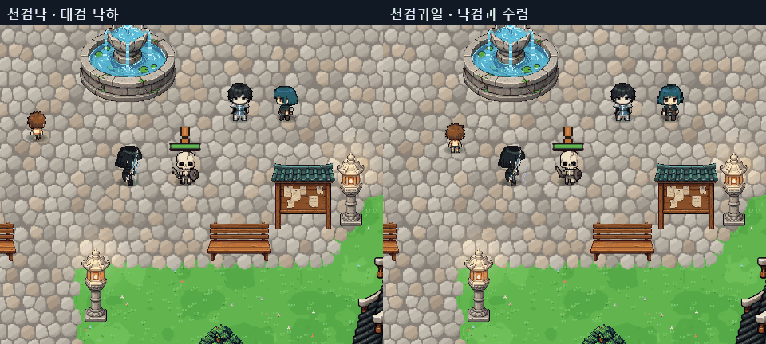

# 파이터 스킬 전면 재설계

2026-10-05. 최신 파이터 구현은 이 문서를 기준으로 한다. 과거 붉은 검격 구성의 이름·아이콘·공격 방식은 새 구성으로 교체했다. 저장 데이터의 내부 ID만 유지하여 기존 습득 단계와 장착 슬롯을 보존한다.

## 레퍼런스 해석과 제작

첨부한 두 시트에서 청색 초승달의 진행 방향, 낙검의 응축–낙하–착지, 황금 돌진의 가늘어지는 꼬리, 보라색 회전 궤적의 열린 중심, 주황색 지면 분출의 상승과 소멸을 참고했다. 원본 이미지를 잘라 사용하지 않고 게임의 위에서 내려다보는 시점과 실제 판정에 맞춘 신규 그림을 제작했다. 청색은 원거리 검기, 황금색은 기동과 잔영, 보라색은 연속 검진, 주황색은 지면 타격으로 구별한다.

신규 투명 PNG 2장에 8개 모티프 × 4프레임, 총 32셀을 제작하고 실제 전투에 연결했다. Point 필터를 사용하며 각 프레임의 원본 영역은 JSON으로 관리한다. 아이콘도 신규 그림에서 생성한다. 임시 대체 이미지가 아닌 현재 게임에서 사용하는 리소스다.

## 새 스킬 구성

수치는 기본 단계 기준이며 공격 계수는 기존 피해 계산식을 통과한다.

| 종류 | 이름 | 동작 | 계수 / MP / 재사용 |
|---|---|---|---|
| 패시브 | 검기 연성 | 기본 공격 명중으로 6초간 최대 3중첩, 다음 전직 스킬 강화 | 3중첩에서 +20%, 단계별 +5% |
| 일반 | 월아검 | 전방 6m 관통 초승달, 폭 1.5m, 적마다 1회 | 2.4 / 12 / 4초 |
| 일반 | 섬광보 | 벽을 확인하는 3m 돌진, 경로의 적에게 1회 | 3.2 / 16 / 7초 |
| 일반 | 자월난무 | 중심 반경 2.8m, 0.24초 간격으로 3회 베기 | 회당 1.45 / 25 / 11초 |
| 패시브 | 파죽지세 | 체력 80% 이상인 적에게 직접 피해 증가 | +15%, 단계별 +5% |
| 일반 | 천검낙 | 전방 5m 내 목표에 검 낙하, 반경 1.8m 착지 타격 | 4.0 / 23 / 9초 |
| 일반 | 염룡승천 | 전방 1.25·2.75·4.25m에 반경 1m 분출, 0.18초 간격 | 회당 1.6 / 26 / 12초 |
| 일반 | 검영추격 | 본체는 남고 전방으로 황금 잔영 3회 공격 | 회당 1.8 / 29 / 14초 |
| 각성 | 천검귀일 | 반경 4m 검진에 낙검 3회와 전체 범위 결정타 | 3.2×3 + 4.8 / 60 / 65초 |

각성은 전직 및 해당 각성 퀘스트 완료 조건을 유지한다. 각성 이야기도 새 이름과 검진 상징에 맞춰 갱신했다. 기본 전사·마법사 Cast 본문과 SkillEffects 파일은 작업 전 사본과 일치한다. 같은 저장소에서 진행 중인 별도 수호자 작업은 보존했다.

## 구현과 리소스

- Assets/Scripts/Runtime/Combat/CareerCombat.Fighter.cs: 새 공격, 시간별 실제 명중, 중단 처리.
- Assets/Scripts/Runtime/Art/FighterReforgeArt.cs: 시트 로딩, 프레임 캐시, 아이콘.
- Assets/Scripts/Runtime/Progression/CareerData.cs, CareerNumbers.cs: 이름, 수치, 툴팁.
- Assets/Scripts/Runtime/Combat/CareerCombat.cs, CareerCombat.Rebuilt.cs, CareerCombat.Renewal.cs: 패시브 연결, 명중 출처 구별, 과거 파이터 처리 제거.
- Assets/Scripts/Runtime/Art/CareerRenewalFx.cs, CareerPaintEffect.cs, CareerPulseArt.cs, CareerArt.cs: 새 시각 효과와 잔영.
- Assets/Scripts/Runtime/Quest/CareerTrials.cs: 각성 이야기.
- Assets/StreamingAssets/CareerRenewal/FighterReforgeA.png 및 FighterReforgeB.png: 신규 원화.
- 같은 경로의 .frames.json: 원본 프레임 좌표.
- [생성 프롬프트](FIGHTER-REFORGE-PROMPTS.json): 전체 제작 프롬프트와 원본 출력 위치.
- server/data/careers.json, server/test/careers.test.ts: 내보낸 파이터 데이터와 검증.

## 확인 결과

- 전체 런타임 검사 308개 통과, 실패 0. 8방향 명중 횟수와 범위 밖 제외, 자원·재사용, 저장 단계, 각성 획득 조건을 포함한다.
- 최신 시각 조정 후 생명주기 검사 5개 통과, 실패 0. 사망·맵 이동 시 지연 공격 취소, 중첩 만료, 기본 직업 각성 제한을 확인했다.
- 서버 careers.test.ts 14개 통과, 실패 0.
- 런타임 및 에디터 컴파일 성공. git diff --check 통과.
- 모든 실행 검증은 볼륨 0. 실제 캡처로 7종 효과와 새 스킬창을 확인했다.
- 캡처 도구에서 RenderTexture.active 해제 순서 경고가 기록되었다. 캡처는 완료됐으며 무경고 실행으로 보고하지 않는다.
- 실제 온라인 두 클라이언트 동시 플레이, 장시간 부하 및 최종 밸런스 검증은 수행하지 않았다.

[런타임 결과](FIGHTER-REFORGE/runtime-results.txt) · [생명주기 결과](FIGHTER-REFORGE/lifecycle-results.txt) · [보존 검사](FIGHTER-REFORGE/invariants.json)

## 로컬 체험과 미리보기

바탕화면의 `dotRPG 만렙 4직업 체험` 바로가기를 사용한다. 실행 파일은 `C:/Users/darac/Documents/Codex/2026-09-30/new-chat-2/work/window-shortcuts-player/dotRPG.exe`이다. 기존 플레이어에 이번에 컴파일한 런타임 DLL과 새 리소스를 갱신했다. Unity 라이선스 제한으로 전체 플레이어를 새로 빌드한 것은 아니다. Git push는 수행하지 않았다.

[7종 전체 움직임](FIGHTER-REFORGE/gallery.gif) · [전체 대표 화면](FIGHTER-REFORGE/gallery.png) · [새 스킬창](FIGHTER-REFORGE/skill-tree.png)
