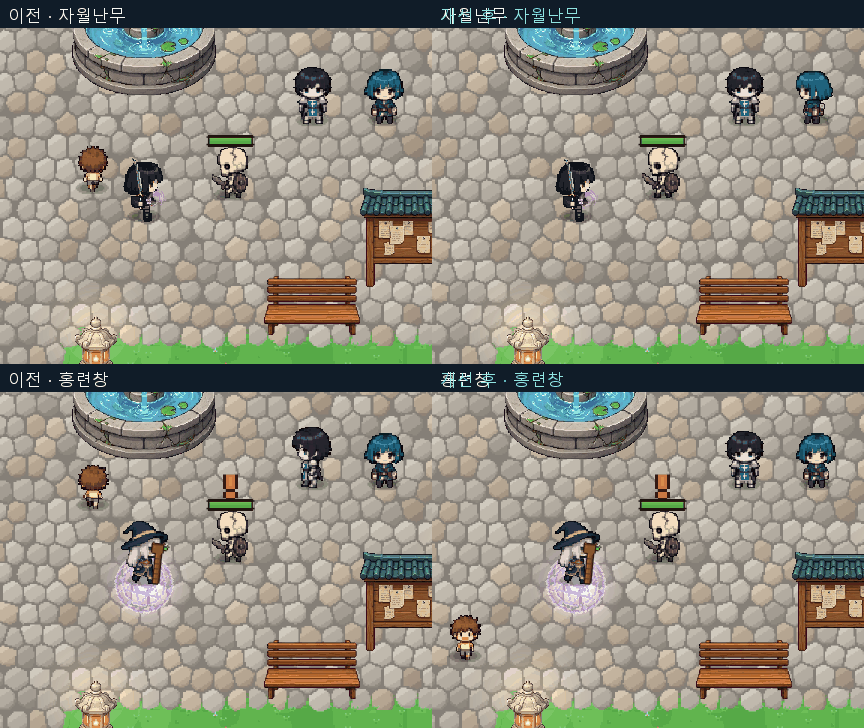

# 전직 스킬 이펙트 자체의 움직임 개선

2026-10-05. 기본 스킬을 참고한 직전 캐릭터 모션 작업에 이어, 액티브·각성기 28종의 이펙트 자체를 개선했다. 캐릭터를 흔들거나 그림 전체 크기만 바꾸는 방식이 아니라, 기존 원화의 내부 형태와 독립된 궤적을 시간에 따라 변형한다.

## 타 게임 조사

- [Riot VFX 업데이트 개발 자료](https://www.leagueoflegends.com/en-us/news/dev/dev-behind-the-scenes-of-vfx-updates/): 정확한 판정 정보와 시각적 가독성을 우선하고 불필요한 세부 잡음을 줄이는 기준을 참고했다.
- [Diablo IV VFX 개발 자료](https://news.blizzard.com/en-us/article/23746639/diablo-iv-quarterly-updatedecember-2021): 효과의 방향과 실제 타격 위치를 일치시키고, 요소별 속도와 강도를 조정하는 원칙을 참고했다.
- [Lee Sin ASU 개발 자료](https://www.leagueoflegends.com/en-us/news/dev/dev-modernizing-the-monk/): 동작 타이밍의 차이를 통해 무게감을 만드는 접근을 참고했다. 다른 게임 이미지는 리소스로 복사하지 않았다.

## 실제 변경

기존 투명 PNG를 8×8 구획의 동적 메시로 표시한다. 불꽃 끝, 검기 꼬리, 결정과 날개 등은 서로 다른 변형 규칙을 사용한다. 별도의 메시에서 끊긴 호·분절 방패·분기 전류·유입하는 빛을 그린다. 픽셀 텍스처의 Point 필터는 유지한다. 신규 PNG를 제작했다고 표시하지 않는다.
명중·이동·회복 타이밍은 기존 효과 생성 지점을 그대로 따른다. 판정 경계는 별도 렌더링으로 유지하며 흐르는 선은 내부 장식이다. 원화 프레임과 움직이는 표면을 결합했고, 수호자 각성 및 지원 효과의 명중 그림에도 연결했다.

| 스킬 | 이펙트 움직임 | 실제 게임 |
|---|---|---|
| 월아검 | 휘어지는 초승달 표면과 이중 검기 궤적 | [재생](LIVING-FX/f_cross.gif) |
| 섬광보 | 흐르는 수평 돌진 줄기 | [재생](LIVING-FX/f_rush.gif) |
| 자월난무 | 내부가 연속 회전하는 소용돌이와 역방향 궤적 | [재생](LIVING-FX/f_flurry.gif) |
| 천검낙 | 검신 떨림과 상승하는 착지 파편 | [재생](LIVING-FX/f_break.gif) |
| 염룡승천 | 끝이 흔들리는 화염과 유동하는 줄기 | [재생](LIVING-FX/f_focus.gif) |
| 검영추격 | 움직이는 잔영 검흔과 보조 호 | [재생](LIVING-FX/f_execute.gif) |
| 천검귀일 | 서로 반대로 도는 검진 흐름 | [재생](LIVING-FX/f_awake.gif) |
| 강철의 보루 | 분절 방패 테두리의 순차 점등 | [재생](LIVING-FX/g_guard.gif) |
| 회귀의 방패 | 실제 이동을 따르는 회전 방패와 분절 테두리 | [재생](LIVING-FX/g_wall.gif) |
| 동행의 보루 | 안정된 중심 주변을 순환하는 방벽 | [재생](LIVING-FX/g_oath.gif) |
| 대지의 호령 | 바깥으로 전달되는 호 형태 파동 | [재생](LIVING-FX/g_taunt.gif) |
| 방패 올려치기 | 방패 타격 표면 변형과 충격파 | [재생](LIVING-FX/g_bash.gif) |
| 응보의 방진 | 방패 면의 미세 반응과 순환 테두리 | [재생](LIVING-FX/g_counter.gif) |
| 천쇄방패 | 각성 방패 표면과 퍼지는 지면 파동 | [재생](LIVING-FX/g_awake.gif) |
| 홍련창 | 불꽃 표면 굴곡과 흐르는 꼬리 | [재생](LIVING-FX/m_fire.gif) |
| 빙결삼창 | 결정 끝의 변화와 위로 흐르는 파편 | [재생](LIVING-FX/m_ice.gif) |
| 연쇄전격 | 24Hz로 바뀌는 분기 전류 | [재생](LIVING-FX/m_storm.gif) |
| 성운낙하 | 비틀리는 천체 표면과 반대 방향 공전 | [재생](LIVING-FX/m_orbit.gif) |
| 차원잔영 | 굴절되는 공간 표면과 내부 순환 | [재생](LIVING-FX/m_veil.gif) |
| 유랑하는 균열 | 이동하는 균열 내부의 연속 회전 | [재생](LIVING-FX/m_rift.gif) |
| 천체 붕괴 | 원소별 변형과 역방향 공전 | [재생](LIVING-FX/m_awake.gif) |
| 치유의 깃 | 흔들리는 깃과 중심으로 모이는 빛 | [재생](LIVING-FX/b_heal.gif) |
| 생명의 파문 | 회복 성역 내부의 완만한 순환 | [재생](LIVING-FX/b_bloom.gif) |
| 정화의 종소리 | 바깥으로 퍼지는 정화 호 | [재생](LIVING-FX/b_cleanse.gif) |
| 심판의 광창 | 전방으로 흐르는 광창 줄기 | [재생](LIVING-FX/b_light.gif) |
| 천사의 품 | 좌우 끝이 펄럭이는 날개와 펼쳐지는 빛 | [재생](LIVING-FX/b_wing.gif) |
| 축복의 연결 | 대상에게 모이는 빛과 깃의 움직임 | [재생](LIVING-FX/b_bless.gif) |
| 천상의 행진 | 펼쳐지는 날개와 성역 내부의 흐름 | [재생](LIVING-FX/b_awake.gif) |

## 파일과 검증

- Assets/Scripts/Runtime/Art/CareerLivingFx.cs: 내부 표면 변형, 궤적 메시, 색·형태 규칙, 캐시와 해제.
- Assets/Scripts/Runtime/Art/CareerRenewalFx.cs: 준비·투사체·영역 효과에 연결, 방패 회전, 검무 방향 보정.
- Assets/Scripts/Runtime/Art/CareerPaintEffect.cs: 명중·지원 효과에 연결.
- Assets/Scripts/Runtime/Art/GuardianAwakeningFx.cs: 각성 방패에 연결.
- Assets/Scripts/Runtime/Core/DevCapture.CareerLiving.cs, DevCapture.CareerMotion.cs, DevCapture.Career.cs: 실행 검사.

최종 **383개 통과, 실패 0**, 볼륨 0. 28종의 내부 형태 변화 및 실제 시전 연결, 기존 모션 검사, 동시 메시 효과 80개 제한, 초기화·맵 이동·사망 후 해제를 확인했다. 런타임·에디터 컴파일도 성공했다. 원래 전투 수치와 공격 처리 파일은 줄바꿈 정규화 후 동일하다.
메시는 효과당 최대 2개이며 최대 80개 효과에만 적용하고, 한 효과의 궤적은 최대 96구간으로 제한했다. 추가 입자 GameObject를 매 프레임 생성하지 않는다. 화면 밖에서는 변형 계산을 생략하고 원래 수명 처리는 계속한다.
온라인 2인 실전, 다양한 GPU 및 장시간 프레임률 검증은 수행하지 않았다. 최종 로그에는 기존 누락 배너·RenderTexture 경고가 남아 있으나 새 렌더러 예외는 없다. 최초 시도에서 발견된 렌더러 컴포넌트 충돌은 자식 메시 구조로 수정한 뒤 전체 재검증했다.

[최종 실행 기록](LIVING-FX/runtime-results.txt) · [전투 코드 보존 확인](LIVING-FX/invariants.json)

비교 화면은 두 실행의 실제 캡처다. NPC 배치와 타격 숫자 등 부수 상태는 프레임별로 완전히 동일하지 않을 수 있다.

바탕화면 「dotRPG 만렙 4직업 체험」에 최신 DLL을 반영했다. 기존 플레이어 패키지를 갱신했으며 Unity 전체 플레이어를 새로 빌드한 것은 아니다. Git push는 수행하지 않았다.
