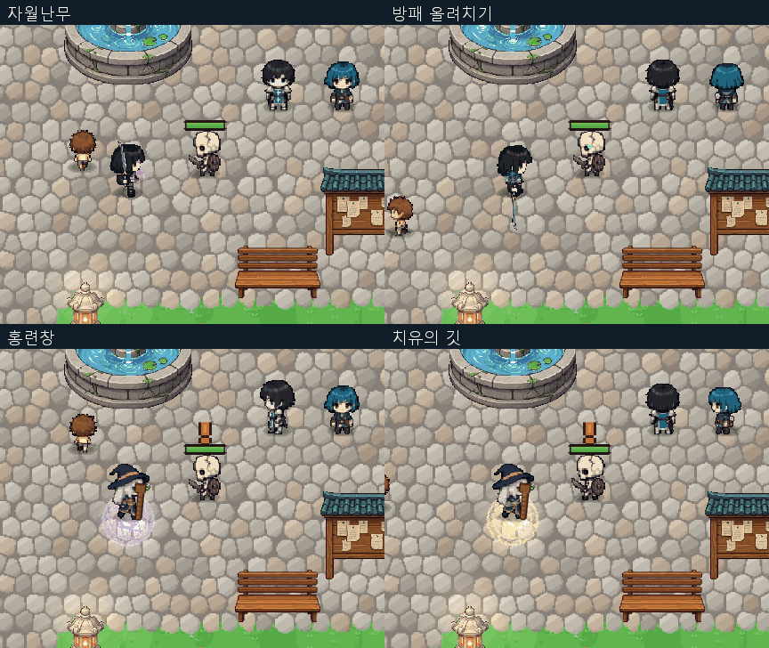

# 전직 스킬 모션 개선 — 기본 스킬 기준

2026-10-05. 전직 4개 직업의 액티브 24개와 각성기 4개, 총 28개 모션을 개선했다. 패시브와 기본 직업 스킬은 유지한다. 새 캐릭터 원화를 그린 작업이 아니라 기존 기본 동작과 리소스를 확장한 코드 기반 연출이다.

## 조사와 적용

- 게임 내부: WarriorAttackMotion의 관절 동작·회복 프레임, WarriorFlameSlash의 손에 붙는 검 궤적, 기본 마법사의 지팡이 들어 내밀기, SkillVisuals.CastCircle/StaffFlash/Sparks/Flash를 재사용했다.
- [Diablo IV 공식 VFX 개발 문서](https://news.blizzard.com/en-gb/article/23746639/diablo-iv-quarterly-updatedecember-2021): 실제 명중 위치·방향과 연출을 맞추고 강한 기술에 강조를 집중하는 원칙을 참고했다.
- [Path of Exile 2 공식 패치 설명](https://www.pathofexile.com/forum/view-thread/3740562/filter-account-type/staff): Firebolt의 범용 시전 애니메이션 교체 사례를 확인하고 기술별 동작 구별에 참고했다.
- [Last Epoch 공식 Sentinel 기술 목록](https://support.lastepoch.com/hc/en-us/articles/46363123727131-Sentinel-Skills): 개별 기술 구성을 조사했다. 다른 게임 원화를 가져와 리소스로 사용하지 않았다.

## 개별 스킬

| 스킬 | 개선 동작 | 실제 게임 |
|---|---|---|
| 월아검 | 발디딤과 전방 검격, 손에 붙는 기본 검 잔상 | [재생](MOTION/f_cross.gif) |
| 섬광보 | 전방으로 몸을 낮추는 돌진과 중심 회복 | [재생](MOTION/f_rush.gif) |
| 자월난무 | 0.24초 연격 박자와 몸의 시각 방향 회전 | [재생](MOTION/f_flurry.gif) |
| 천검낙 | 실제 0.22초 낙하 대기에 맞춘 내려베기 | [재생](MOTION/f_break.gif) |
| 염룡승천 | 0.18초 분출 박자에 맞춘 내려치기 반동 | [재생](MOTION/f_focus.gif) |
| 검영추격 | 0.18초마다 3단 검격 자세를 바꾸는 잔영 연계 | [재생](MOTION/f_execute.gif) |
| 천검귀일 | 높은 준비, 낙검 박자, 결정타와 긴 복귀 | [재생](MOTION/f_awake.gif) |
| 강철의 보루 | 무게중심을 낮춰 버티는 방어 | [재생](MOTION/g_guard.gif) |
| 회귀의 방패 | 상체를 비틀어 방패를 던지고 중심 회복 | [재생](MOTION/g_wall.gif) |
| 동행의 보루 | 좁고 안정적인 버티기 자세로 방벽 전개 | [재생](MOTION/g_oath.gif) |
| 대지의 호령 | 상체를 펴는 호령과 반동 | [재생](MOTION/g_taunt.gif) |
| 방패 올려치기 | 0.12초 전진 후 판정에 맞춘 올려치기 | [재생](MOTION/g_bash.gif) |
| 응보의 방진 | 공격 동작 대신 낮게 버티는 반격 준비 | [재생](MOTION/g_counter.gif) |
| 천쇄방패 | 깊은 준비와 높게 들어 내려치는 각성 | [재생](MOTION/g_awake.gif) |
| 홍련창 | 기본 지팡이 시전을 확장한 전방 뻗기 | [재생](MOTION/m_fire.gif) |
| 빙결삼창 | 수정창 0.065초 발사 박자의 반복 반동 | [재생](MOTION/m_ice.gif) |
| 연쇄전격 | 빠른 방출과 짧은 반복 반동 | [재생](MOTION/m_storm.gif) |
| 성운낙하 | 지팡이 끝의 원호 동작과 연속 사출 | [재생](MOTION/m_orbit.gif) |
| 차원잔영 | 몸을 모아 앞으로 기울이고 이동 후 복귀 | [재생](MOTION/m_veil.gif) |
| 유랑하는 균열 | 지팡이로 원호를 그리며 균열 방출 | [재생](MOTION/m_rift.gif) |
| 천체 붕괴 | 높은 준비, 0.35초 원소 방출 박자와 복귀 | [재생](MOTION/m_awake.gif) |
| 치유의 깃 | 작은 상체 들기와 지팡이를 내미는 회복 | [재생](MOTION/b_heal.gif) |
| 생명의 파문 | 낮고 느린 준비로 성역 시작 표현 | [재생](MOTION/b_bloom.gif) |
| 정화의 종소리 | 바깥으로 밀어내는 지팡이 정화 | [재생](MOTION/b_cleanse.gif) |
| 심판의 광창 | 전방 지팡이 찌르기와 빠른 회수 | [재생](MOTION/b_light.gif) |
| 천사의 품 | 몸을 펴며 위로 드는 보호 자세 | [재생](MOTION/b_wing.gif) |
| 축복의 연결 | 반복 지팡이 동작으로 축복 연결 | [재생](MOTION/b_bless.gif) |
| 천상의 행진 | 높은 준비와 천천히 내려오는 성역 마무리 | [재생](MOTION/b_awake.gif) |

## 구현

몸체·무기·손에 같은 시각 피벗을 적용하고 그림자와 콜라이더는 유지한다. 전사는 기존 관절 프레임을 스킬 박자에 맞춰 선택하고, 마법사는 기존 공격·보행·정지 프레임과 지팡이 동작을 조합한다. 효과 시트는 준비·가속·접촉·잔상 순서로 재생한다.
실제 명중 시 35ms 시각 포즈 정지를 사용한다. Time.timeScale이나 피해 판정은 변경하지 않는다. 명중 불꽃은 발생 간격을 제한한다. 기본 스킬 전환·상태 초기화·맵 변경 시 포즈를 해제하고, 코드에서 사망·비활성화도 해제한다.

## 변경 파일

- Assets/Scripts/Runtime/Player/CareerSkillMotion.cs: 28개 모션 설정, 프레임·무기·시각 명중 정지.
- Assets/Scripts/Runtime/Player/CharacterAnimator.cs: 프레임과 바라보기 연결.
- Assets/Scripts/Runtime/Player/SkillCaster.cs: 기본 스킬 사용 시 전직 포즈 해제.
- Assets/Scripts/Runtime/Combat/CareerCombat.cs: 준비·방출·초기화 연결.
- Assets/Scripts/Runtime/Art/CareerRenewalFx.cs: 효과 프레임과 잔상 움직임.
- Assets/Scripts/Runtime/Art/CareerImpact.cs: 확인된 명중에 기본 스킬 방식의 불꽃 연결.
- Assets/Scripts/Runtime/Core/DevCapture.CareerMotion.cs 및 DevCapture.Career.cs: 실행 검증.

## 검증과 제한

- 최신 런타임 검사 **322개 통과, 실패 0**. 28개 스킬 전체 실행, 8방향 시각 좌표, 프레임 변화, 중립 복귀, 콜라이더 유지, 기본 스킬 전환, 초기화·맵 변경을 확인했다. 전 과정 볼륨 0.
- 런타임·에디터 컴파일 성공. [수치·공격 처리 보존 검사](MOTION/invariants.json): 줄바꿈 정규화 후 기존 소스와 동일.
- [실행 결과](MOTION/runtime-results.txt) · [컴파일](MOTION/compile.txt).
- 실제 온라인 2인 플레이, 장시간 부하, 사망 시나리오의 별도 실행 검증은 수행하지 않았다.
- 캡처의 RenderTexture 해제 경고와 기존 누락 배너 경고가 로그에 있다. 무경고 실행으로 보고하지 않는다.

바탕화면 「dotRPG 만렙 4직업 체험」에 최신 런타임 DLL을 반영했다. 기존 플레이어 패키지를 갱신한 것이며 Unity 전체 플레이어 빌드를 새로 만든 것은 아니다. 이번 변경은 Git push하지 않았다.

