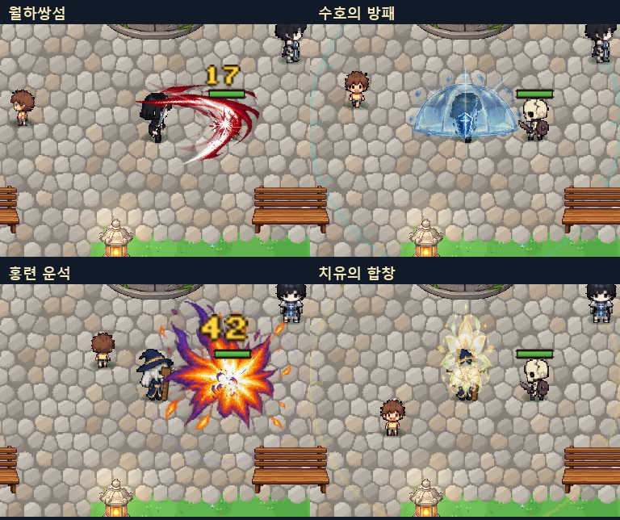
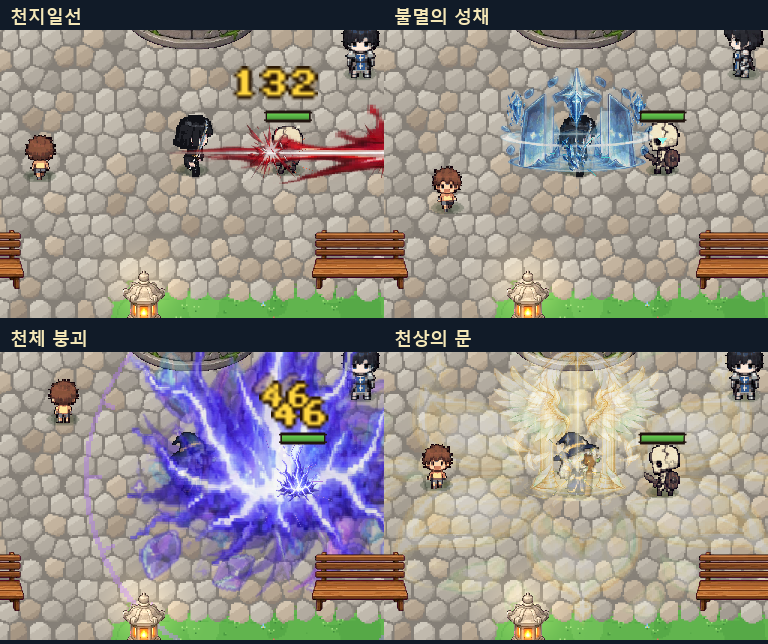

# 전직 스킬 이펙트 교체 · Pulse

이 문서는 이전 Pulse 단계의 기록이다. 현재 적용된 동작·원화·검증 결과는 [Renewal 보고서](RENEWAL.md)를 참조한다.

2026-10-05 · jaein. 파이터·수호자·메이지·비숍의 일반 액티브 24개와 각성기 4개에 새 연속 프레임 그림과 직업별 움직임을 연결했다. 패시브는 기존 조건에서 짧은 상태 배지만 보여준다.

## 주요 변화

- **파이터**: 월하쌍섬은 방향이 교차하는 초승달 검격, 비연검무는 서로 다른 박자의 연격, 파공검기는 앞으로 향하는 날카로운 검기. 발도와 천지일선은 실제 직선 판정과 같은 방향으로 즉시 펼쳐지는 검흔이다. 응축→빠른 베기→짧은 명중 정점→갈라져 사라지는 잔상으로 연결했다.
- **수호자**: 방패가 조각에서 형성되고 방패 돌격은 앞으로 밀려나는 압력파를 쓴다. 도발·반격은 중심에서 사방으로 퍼지고, 결속은 방벽 양쪽에 작은 방패를 펼친다. 불멸의 성채는 성벽·중앙 수호 문양·방패가 순차 전개된다. 보호막 유지는 낮은 투명도로 표시하고 실제 흡수 순간 표면 반응이 나타난다.
- **메이지**: 낙하 운석의 불꽃 꽃잎과 잔불, 솟아나는 얼음 왕관과 파편, 형태가 빠르게 바뀌는 분기 낙뢰, 회전하는 추적성, 수축하는 차원 잔광을 구분했다. 천체 붕괴는 기존 세 번의 판정 시점에 운석→빙하→낙뢰를 각각 큰 연출로 방출한다.
- **비숍**: 치유는 위로 모이는 빛과 꽃, 정화는 퍼져 걷히는 꽃잎, 보호는 펼쳐지는 날개, 축복은 상승하는 후광, 광창은 방향을 가진 빛줄기로 구분한다. 천상의 문은 문과 날개가 순차로 펼쳐진다. 성역은 실제 회복 주기에만 맥동한다.
- **타격감**: 권한을 가진 클라이언트에서는 HP가 줄어든 순간에만 명중 섬광·파편·짧은 실루엣 잔상이 생긴다. 무적과 빗나감은 명중 반응을 만들지 않는다. 강한 공격은 설정을 따르는 작고 짧은 방향성 카메라 충격을 쓴다. 적의 실제 위치·물리·AI를 변경하거나 전투 시간을 멈추지 않는다. 온라인 멤버는 기존 방식대로 시각 효과만 예측한다.

## 실제 리소스

- `Assets/StreamingAssets/CareerPulse/{Fighter,Guardian,Arcanist,Bishop}.png`: image_gen으로 새로 제작한 투명 RGBA 원본 4장, 각 1254×1254. 각 시트는 4개 소재 행 × 준비/방출/명중/소멸 4개 열이다. **64개 프레임이 모두 서로 다른 이미지**임을 해시로 확인했다.
- 런타임은 완성된 준비 단계 이후 공격을 방출 프레임부터 시작하며, 명중 관찰자는 명중 프레임부터 즉시 재생한다. 명중 정점은 짧게 유지한다. 네 장의 정적인 이미지를 회전시키는 방식으로만 처리하지 않는다.
- Point/Clamp, 밉맵 없음. 업로드 후 CPU 픽셀 사본을 해제하고 시트·스프라이트를 재사용한다. 피벗은 모든 셀 중심으로 통일한다.
- 작은 검흔 파편·명중 십자 섬광은 별도로 제작한 코드 기반 픽셀 소재를 캐시한다.
- `CareerReborn`의 기존 그림은 스킬 아이콘용으로 유지된다. 기존 절차형 CareerArt는 새 시트가 빠진 경우 CareerEffect 호출의 호환 대체물이다. 이 대체물을 이번 새 원화로 계산하지 않았다.
- [프롬프트](PULSE-PROMPTS.json) · [원본·프레임 매니페스트](../../Assets/StreamingAssets/CareerPulse/manifest.json)

## 변경 코드

- `Assets/Scripts/Runtime/Art/CareerPulseArt.cs`: 4×4 시트 로딩·프레임 선택·캐시·소형 픽셀 소재.
- `Assets/Scripts/Runtime/Art/CareerPaintEffect.cs`: 직업과 스킬별 준비·방출·이동·잔상, 지속 효과·각성 단계.
- `Assets/Scripts/Runtime/Art/CareerPaintArt.cs`: 기존 아이콘 구현을 분리해 유지.
- `Assets/Scripts/Runtime/Art/CareerImpact.cs`: 실제 적중에 연결된 짧은 시각 반응. 동시 32개 제한.
- `Assets/Scripts/Runtime/CameraSystem/CameraFollow.cs`: 전투 RNG를 소비하지 않는 카메라 충격. 접근성 설정 및 파티 동료 흔들림 제한 준수.
- `Assets/Scripts/Runtime/Combat/CareerPresentation.cs`: 분기 낙뢰·방벽 상태·실제 적용 주기의 맥동.
- `Assets/Scripts/Runtime/Combat/CareerCombat.cs`, `CareerCombat.Rebuilt.cs`: 기존 판정 위치에 표시 호출 연결과 초기화 시 효과 정리. 계산 수식과 판정 시점은 유지.
- `Assets/Scripts/Runtime/Core/DevCapture.Pulse.cs`, `DevCapture.Career.cs`: 새 프레임과 실제 명중·빗나감·연결 검증.

## 확인 결과

- 볼륨 **0**으로 실행했다. 전체 전직 검증 **513 통과 / 0 실패**, 최종 로더와 추가 명중 검증 **73 통과 / 0 실패**. 두 실행에는 중복 검증 항목이 있어 숫자를 합산하지 않았다.
- 28개 액티브/각성의 실제 Cast 실행에서 새 원화 호출 연결을 확인했다. 피해·회복·보호막, 도발, 영역 이탈/재진입, 8방향 직선/부채꼴, 관통·연쇄·각성 잠금, 저장 검증을 통과했다.
- 실제 피해가 막힌 경우·공격이 빗나간 경우 명중 반응이 없고, 두 번 베기에서 정확히 두 번 생기며 종료 후 잔상 객체가 제거됨을 확인했다.
- 이펙트·범위 경계·연결선 동시 상한과 종료·사망·맵 이동 정리를 확인했다. 지속 회복 초기화 시 원화도 정리된다.
- 기본 전사/마법사 효과와 SkillCaster, 전직 스킬 데이터·수치·서버 카탈로그 파일은 변경 전과 **바이트 해시가 동일**하다. [해시 확인](PULSE/invariants.json)
- Runtime와 Editor C# 컴파일 성공. 기존 obsolete API 및 멤버 숨김 경고는 남아 있다.
- [전체 실행 기록](PULSE/runtime-results.txt) · [추가 명중 기록](PULSE/hit-results.txt)

## 실제 게임 비교

[일반 스킬 전후 GIF](PULSE/normal_comparison.gif) · [각성기 전후 GIF](PULSE/awakening_comparison.gif) · [천지일선 전체 길이](PULSE/world_cut.png)

GIF는 같은 마을에서 실제 Cast를 실행한 1.8초 발췌다. 6~8초 지속 효과의 전체 수명을 담은 영상은 아니다. 원화 시트나 목업으로 게임 화면을 대체하지 않았다.

## 체험 위치와 검증 범위

바탕화면 **dotRPG 만렙 4직업 체험** 바로가기에 연결된 로컬 플레이어에 새 Runtime DLL과 네 시트를 반영했다. 기존 체험용 40레벨 4개 슬롯과 일반 저장 데이터는 유지했다. 로컬 실행 파일은 `C:/Users/darac/Documents/Codex/2026-09-30/new-chat-2/work/window-shortcuts-player/dotRPG.exe`다.

Unity 에디터 전체 배포 번들 재빌드, 온라인 두 클라이언트 동시 실전, 장시간 FPS/메모리 측정은 이번에 수행하지 않았다. 위 확인 결과는 로컬 플레이어 실행 및 자동 검증 범위다.
