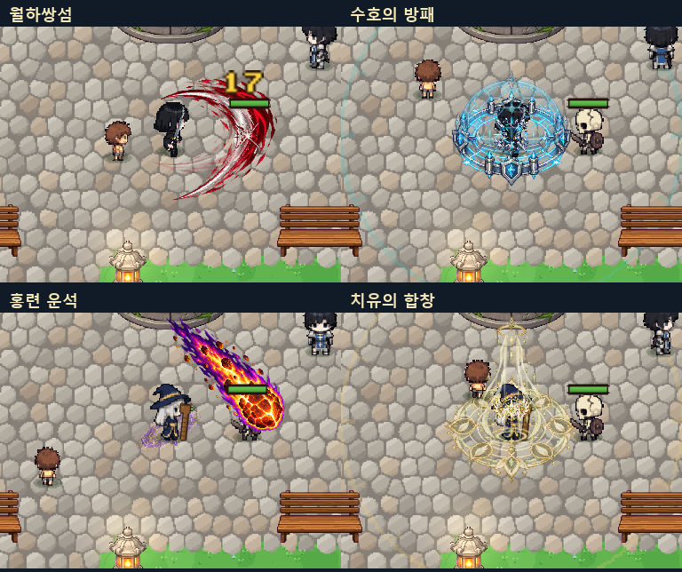

# 전직 스킬 재구성 — Reborn

2026-10-05 · jaein 브랜치. 최신 요청에 따라 **전직 스킬의 구성·판정·수치와 그래픽을 함께 재설계**했다. 이전의 “시각 효과만 변경” 단계와 범위가 다르다. 기본 전사/마법사 공격 구현은 이번 변경 전과 동일하다.

## 직업별 구성

- 파이터: 전방 부채꼴 교차 베기, 충돌을 확인하는 돌파, 이동하는 관통 검기, 긴 발도. 각성 **천지일선**은 전방 18m·폭 3.6m의 한 번의 직선 타격이다. 지형 이미지를 실제로 파괴하는 기능은 아니다.
- 수호자: 자기 방어, 파티 보호막, 피해 감소, 5m 도발, 방패 돌격, 충격 반격. 각성 **불멸의 성채**는 6m 아군에게 방벽을 제공한다.
- 메이지: 낙하 운석, 빙하, 적 사이를 순차 연결하는 번개, 추적 마력탄, 차원 보행, 지속 마법진. 각성 **천체 붕괴**는 운석→빙하→낙뢰로 전개한다.
- 비숍: 파티 동시 회복, 진입·이탈을 확인하는 회복 성역, 정화, 관통 광창, 날개 보호막, 공격 축복. 각성 **천상의 문**은 즉시 회복·정화·보호막과 8초 성역을 제공한다.

각 직업의 패시브 2개 / 액티브 6개 / 각성 1개 구조, 36개 저장 ID, 전직·각성 퀘스트 잠금은 유지한다. 상시 패시브가 전장을 계속 덮는 효과는 추가하지 않았다.

## 실제 그래픽과 파일

- `Assets/StreamingAssets/CareerReborn/{Fighter,Guardian,Arcanist,Bishop}.png`: 새로 제작한 투명 RGBA 원화 4장, 각 1254×1254, 4분할 소재 16개. 다른 게임 이미지의 복사본이 아니다.
- `CareerPaintEffect.cs`: 원화 레이어의 전개·이동·회전·수렴·소멸, 검기 이동, 운석 낙하, 긴 검흔, 성역 유지. Point 보간과 제한된 동시 객체 80개.
- `CareerPaintArt.Icon`: 새 원화로 구성한 64×64 스킬 아이콘 36개. 스킬별 조합과 단계 표식.
- 기존 `Reforged` 절차형 이미지는 파일 누락 시의 호환용 대체 리소스로 남아 있다. 정상 플레이는 새 원화를 사용하며 대체 리소스를 새 제작물로 보고하지 않는다.
- 생성 도구: 내장 `image_gen`. 정확한 프롬프트와 자산 목록은 [프롬프트](REBORN-PROMPTS.json), [매니페스트](../../Assets/StreamingAssets/CareerReborn/manifest.json)에 기록했다.

## 구현 위치

- `Assets/Scripts/Runtime/Progression/CareerData.cs`, `CareerNumbers.cs`: 구성·설명·수치.
- `Assets/Scripts/Runtime/Combat/CareerCombat.cs`, `CareerCombat.Rebuilt.cs`: 실제 판정·투사체·회복·버프. 멤버 클라이언트는 표시만, 호스트가 HP/상태 변경을 담당한다.
- `Assets/Scripts/Runtime/Art/CareerPaintEffect.cs`, `CareerArt.cs`: 새 그림과 렌더 연결.
- `Assets/Scripts/Runtime/Player/SkillCaster.cs`: 전직별 연속 동작 시간. 성역 때문에 조작을 8초간 잠그지 않는다.
- `Assets/Scripts/Runtime/Quest/CareerTrials.cs`: 새 이름과 각성 이야기 연결.
- `Assets/Scripts/Runtime/Core/DevCapture.Reborn.cs`, `DevCapture.Career.cs`: 실제 플레이 검증과 캡처.
- `server/data/careers.json`, `server/test/careers.test.ts`: 클라이언트 카탈로그와 저장 계약 검증.

## 검증과 한계

- 최종 무음 실행: **416 통과 / 0 실패**. 로그의 AudioListener 볼륨 0 확인.
- 서버 TypeScript 빌드 성공. 전직·캐릭터 서버 테스트 **58 통과 / 0 실패**.
- Runtime / Editor C# 컴파일 성공. 기존의 obsolete API 경고는 남아 있다.
- 8방향 부채꼴/직선 판정, 검기 1회 관통, 12m 목표 각성 적중, 영역 밖·뒤쪽 대상 제외, 번개 중복/거리 제한, 파티 동시 회복, 성역 이탈·재진입, 리셋 후 회복 중단 확인.
- 기존 회복·보호막·도발·빙결·각성 시련, 저장/네트워크 카드 직렬화, 사망·맵 전환 정리 및 동시 효과 상한 검증 통과.
- 기본 스킬 구현과 저장 ID 유지 확인: [invariants.json](REBORN/invariants.json).
- 온라인 두 클라이언트의 실제 동시 전투와 장시간 FPS/메모리 프로파일링은 이번에 수행하지 않았다. 호스트/멤버 분기 코드와 저장 직렬화 검증 범위만 확인했다.
- 로컬 데모는 기존 Unity 플레이어에 새 Runtime DLL과 StreamingAssets를 함께 배치하여 실행 검증했다. Unity 에디터를 통한 전체 배포 번들 재빌드는 이번 단계에서 수행하지 않았다.

## 실제 게임 미리보기

[일반 스킬 전후 GIF](REBORN/normal_comparison.gif) · [각성기 전후 GIF](REBORN/awakening_comparison.gif) · [천지일선 전체 길이](REBORN/world_cut.png) · [스킬 아이콘](REBORN/icons.png)

GIF는 동일한 마을에서 실제 Cast 코루틴을 재생한 1.8초 발췌이다. 지속 성역의 전체 시간을 압축한 영상은 아니다.

## 기본 수치와 기능

랭크 1 기준. 피해·회복은 공격력 배율이며 장비·노드·지원 젬에 따라 실제 UI 수치가 달라진다. 범위 수치는 기본값이다.

### 파이터

|스킬|기능|MP|재사용(초)|
|---|---|---:|---:|
|연격의 호흡|적중 시 4초간 공격 속도 +3%/중첩, 최대 5중첩.|0|0.0|
|월하쌍섬|전방 120도 부채꼴을 좌우 교차로 두 번 벤다.|10|4.0|
|무영일섬|전방 4m를 돌파하며 지나친 적을 한 번씩 벤다. 벽 앞에서 정지.|16|8.0|
|비연검무|전방 140도에 사선·역베기·수평검의 세 박자를 펼친다.|24|11.0|
|예리한 결의|직접 공격 치명타 확률 +8%, 치명 피해 150%.|0|0.0|
|파공검기|초승달 검기가 7m를 관통. 적중한 적에게 6초간 자신의 후속 피해 +15%.|18|7.0|
|검신합일|검의를 응축해 6초간 치명타 확률 +25%.|20|18.0|
|발도·단공|전방 8m, 폭 1.4m의 직선을 관통하는 발도. 체력 35% 이하 적에게 +50%.|28|14.0|
|천지일선|검의를 한 줄에 모아 전방 18m, 폭 3.6m의 전장을 가르는 일격.|55|65.0|

### 수호자

|스킬|기능|MP|재사용(초)|
|---|---|---:|---:|
|강철의 심장|받는 피해 추가 6% 감소. 다른 감소와 합산, 최대 65%.|0|0.0|
|강철의 보루|5초간 받는 피해 30% 감소, 이동 속도 30% 감소.|12|9.0|
|수호의 방패|반경 4m 아군에게 최대 HP의 20% 보호막, 6초.|24|14.0|
|결속의 성벽|6초간 반경 4m 아군 피해 20% 감소, 보호막 12%.|30|20.0|
|수호의 반향|피격 후 다음 공격 피해 +20%. 재충전 2초, 재귀 반격 없음.|0|0.0|
|불퇴의 호령|반경 5m 적의 공격 대상을 본인으로 4초 고정. 보스 1.2초, 최대 위협 150%.|12|8.0|
|방패 돌격|전방 3m를 돌진하며 경로의 적에게 방패치기. 기절 1초(보스 0.3초).|18|7.0|
|응보의 방진|3초 피해 25% 감소. 받은 충격을 1회 방출, 피격이 없으면 종료 시 방출.|22|13.0|
|불멸의 성채|거대한 성채 전개. 8초간 반경 6m 아군에게 40% 보호막·35% 피해 감소, 적 도발.|50|70.0|

### 메이지

|스킬|기능|MP|재사용(초)|
|---|---|---:|---:|
|원소의 기억|다른 원소로 직접 적중하면 피해 +12%. 같은 원소 반복은 제외.|0|0.0|
|홍련 운석|전방 목표에 운석 낙하. 반경 2m 폭발과 3초 화상(매초 공격력 20%).|24|6.0|
|빙하의 왕관|전방 목표 주위 반경 2.6m에 얼음 기둥을 솟구쳐 1.5초 빙결.|26|8.0|
|연쇄 낙뢰|전방 적에서 시작해 3m 안의 다른 적으로 최대 5번 연결. 같은 적 중복 제외.|32|10.0|
|마력 순환|전직 공격 주문의 MP 소모 10% 감소. 중첩하지 않음.|0|0.0|
|비전 추적성|시간차로 날아가는 마력탄 3개가 전방의 적을 추적한다.|24|7.0|
|차원 보행|잔광을 남기고 장애물 앞까지 3m 이동. 최대 HP 10% 보호막 2초.|28|16.0|
|별의 소용돌이|반경 3m의 고정 마법진에 5초간 매초 마력 폭발. 영역을 벗어나면 피해 없음.|38|15.0|
|천체 붕괴|겹쳐진 천체 마법진 위로 운석·빙하·낙뢰가 차례로 강림. 두 번째 폭발은 1초 빙결.|65|65.0|

### 비숍

|스킬|기능|MP|재사용(초)|
|---|---|---:|---:|
|생명의 숨|회복량 +10%. 최대 HP를 넘는 회복은 발생하지 않음.|0|0.0|
|치유의 합창|반경 4m 안 자신과 파티원을 동시에 즉시 회복.|20|5.0|
|생명의 성역|시전 위치 반경 3.5m에 6초간 성역 생성. 안에 있는 아군을 매초 회복.|26|10.0|
|정화의 종소리|반경 4m 아군의 저주·둔화를 해제하고 소량 회복.|24|11.0|
|축복의 그릇|보호막량 +12%. 중복 사용은 합산 없이 큰 값으로 갱신.|0|0.0|
|심판의 광창|전방 7m, 폭 1.2m에 빛의 창을 관통시킨다.|14|4.0|
|천사의 품|빛의 날개로 반경 4m 아군을 감싸 최대 HP 18% 보호막, 6초.|26|14.0|
|영광의 축복|반경 4.5m 아군 공격 피해 +18%, 8초. 같은 축복은 갱신.|28|19.0|
|천상의 문|반경 6m 아군 정화·즉시 회복·25% 보호막 8초. 시전 지점에 8초 회복 성역 전개.|60|70.0|
