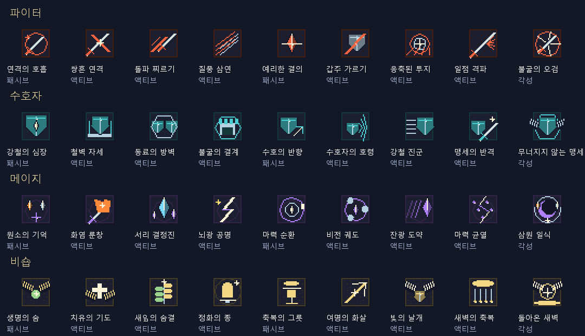
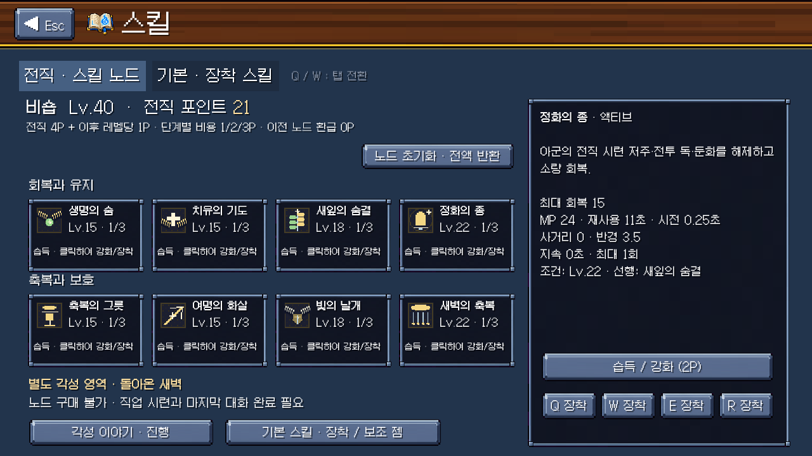
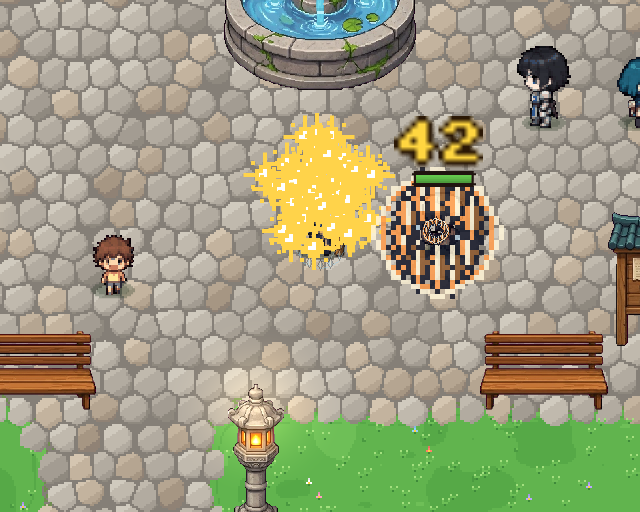

# 전직 시스템 검증 결과

작업 브랜치: `jaein`. 검증일: 2026-10-05. 기능 명세는 [SYSTEM.md](SYSTEM.md), 실제 대사는 [STORIES.md](STORIES.md).

## 확인한 결과

|영역|실제 실행 및 결과|
|---|---|
|클라이언트 컴파일|Unity 6000.5.9f1의 참조 어셈블리와 Roslyn으로 Runtime·Editor C# 어셈블리 모두 성공. 기존 obsolete/member-hiding 경고 있음.|
|런타임|기존 로컬 Unity 플레이어 사본에 새 Runtime DLL을 적용하여 **221개 통과, 0개 실패**. 격리된 저장 경로 사용.|
|서버 빌드|`server`에서 `npm run build` 성공.|
|서버 회귀 검사|`npm test -- --runTestsByPath test/careers.test.ts test/characters.test.ts` — **2개 스위트, 57개 통과**. 격리된 테스트 PostgreSQL에서 마이그레이션·HTTP 저장/로드 실행.|
|그래픽 파일|36개 32×32 아이콘 + 28개 1152×96 시트. 모든 파일 RGBA, 투명 영역 있음, 서로 다른 픽셀 데이터, 카탈로그 경로 및 `.meta` 존재 확인.|
|화면 확인|4직업 노드·상세·각성 대화 화면 총 12장, 4각성 실제 전투 장면 캡처. 비숍 상세 설명과 버튼 겹침 수정 후 다시 캡처하여 확인.|
|Git 검사|`git diff --check` 통과.|

[전체 런타임 결과](runtime-results.txt), [서버 검사 결과](server-results.txt), [리소스 크기·SHA256 기록](resource-check.json).

221개 검사는 전직 레벨/계열/중복 제한, 2·6·1 구성, 기본 스킬 유지, 노드 비용·선행·다른 직업 차단, 각성 조건·잘못된 장착 차단, 저장·반복 로드·이전 노드 환급, 파티 카드 직렬화 왕복, MP·쿨다운·슬롯 교체, 실제 피해·회복·보호막·정화·도발·반격, 4개 역할 시련 완료와 실패/재도전을 포함한다. 마지막 검사 이후 변경은 설명 문구(지원하지 않는 독 해제 문구 제거), UI 문구 길이, 불필요한 조회 시 저장 제거, 문서/데이터 버전 정리이다. 최종 소스의 Runtime·Editor 컴파일과 최종 서버 57개 검사는 다시 통과했다.

## 실행 방법

1. Unity에서 프로젝트를 열고 Play. 레벨 15 이상 캐릭터의 스킬창 또는 각 마을 광장 전직 안내원으로 이동한다.
2. 전사라면 파이터/수호자, 마법사라면 메이지/비숍을 비교하고 확정한다. 선택 확정 후 다시 전직할 수 없다.
3. 처음 4P로 전용 노드를 배운다. 액티브는 Q/W/E/R 슬롯에 장착하고, 기본 스킬은 별도 탭에서 계속 선택한다. 키를 재설정했다면 설정한 키가 적용된다.
4. 각성 이야기에서 도입/갈등 대화를 읽고 역할 시련을 시작한다. 필요한 노드와 레벨은 화면에 표시된다. 시련 중에는 메뉴가 닫히고 실제 전투가 진행된다.
5. 성공 후 깨달음/마무리 대화를 완료하면 전용 각성기가 T 슬롯에 열린다. 보상에 포인트는 소비하지 않는다.

자동 재검증은 새로 빌드한 개발 플레이어에 `-dotrpgCareer <결과 폴더>`를 전달한다. UI만 확인할 때 `-careerUiOnly`도 전달한다. 이 모드는 개발용 자동 실행으로 새 테스트 캐릭터를 만들며, 일반 게임 실행에는 사용하지 않는다. 서버 명령은 위 표 참조.

## 확인하지 못한 범위와 현재 제약

- **전체 Unity 임포트와 새 실행 파일 빌드는 완료하지 못했다.** Unity Editor가 `No valid Unity Editor license found`로 종료 코드 198을 반환했다. 라이선스 활성화 후 전체 임포트·빌드가 필요하다. C# 수동 컴파일 성공을 전체 Unity 빌드 성공으로 간주하지 않는다.
- 실행 검증에 사용한 기존 플레이어에는 새 Resources 번들이 없으므로 PNG와 동일한 `CareerArt` 제작 원본을 통해 효과를 재생했다. PNG 파일 자체의 내용/연결/임포트 설정은 검사했지만, 새 빌드에서 패키징된 PNG를 실제 로드하는 경로는 전체 빌드 후 추가 확인해야 한다.
- 서버 코드는 구현·검사했으나 운영 서버에 배포하지 않았다. 배포 시 클라이언트와 서버를 함께 업데이트하고 `0014_careers.sql`을 적용해야 한다. 데이터 버전은 클라이언트/서버에 동일하게 기록했고 파티 와이어 버전은 6이다.
- 파티 직업/노드/각성 데이터 직렬화와 호스트 권한 코드는 연결했지만, 두 PC의 실시간 파티 전투는 검증하지 않았다. 서버는 기존 스냅샷 저장 모델에 맞춰 조건/범위/직업/불변 환급을 검증하며 시련 전투를 서버에서 재실행하는 부정행위 방지 시스템은 아니다.
- 각성 시련은 솔로이며 온라인 파티에 들어간 상태에서는 시작을 막는다. 아군 역할은 시련 동료 아이비가 제공한다.
- NPC 대사는 전직 안내원의 시련 기록 화면으로 제공한다. 기존 기본 직업 인물 컷인을 재사용했다. 직업별 신규 인물 초상화, 성우, 영상 컷신은 제작하지 않았다. 각성의 이름·문양·아이콘·전투 효과·오라는 구현했다.
- 정화는 새 전투 상태 시스템의 저주와 둔화를 해제한다. 별도 일반 독/화상 디버프 시스템을 새로 추가한 것은 아니다.
- 수치는 기존 공격력/MP/HP/최고 레벨을 기준으로 설계하고 동작 검증했다. 장시간 사냥·보스·PvP의 실측 밸런스 검증은 하지 않았다.

## 미리보기

GIF는 비교용으로 같은 12프레임을 반복하며, 게임에서는 일반/각성/시전/다단 적중에 맞는 속도로 재생한다.

