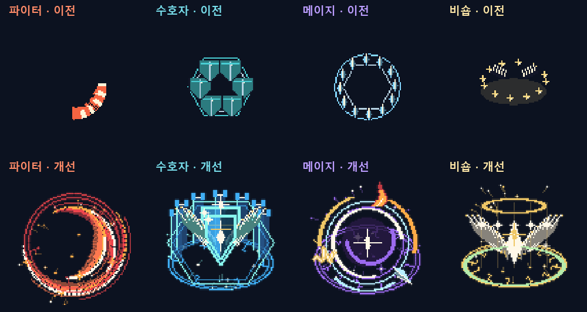
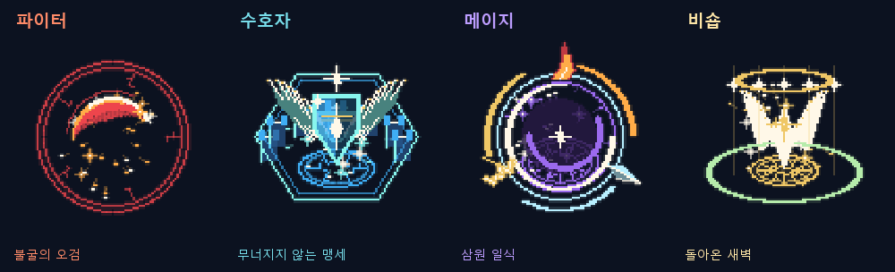
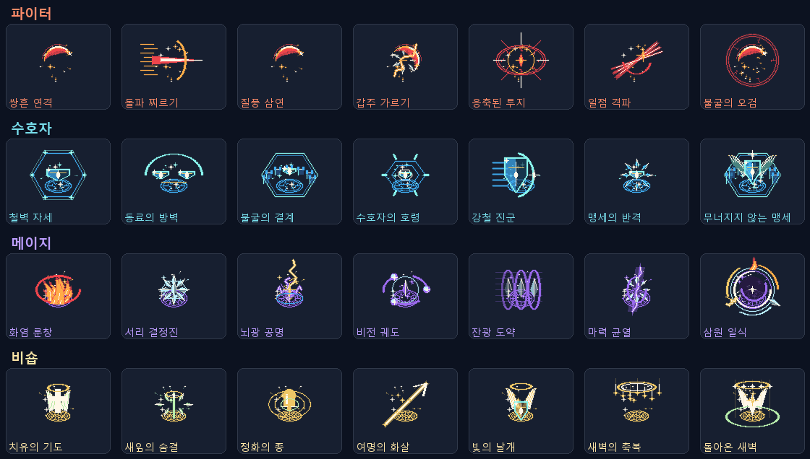

# 스킬 이펙트 개선

전직 4직업의 24개 일반 액티브와 4개 각성기 전부를 다시 제작했다. 각 직업의 별도 시전/명중 시트 8개를 추가하여 큰 전체 효과를 적마다 반복하던 구성을 바꿨다.

- 파이터: 뜨거운 중심선·붉은 외곽·주황 잔상이 있는 곡선 검광, 찌르기 돌풍, 갑옷 파편, 5연격 후 교차 결정타.
- 수호자: 명암을 넣은 강철 방패, 단계적으로 솟는 성벽, 육각 충격파, 금속 파편과 각성 수호 문양.
- 메이지: 회전 룬, 불꽃 기둥과 불티, 면이 나뉜 얼음 결정, 갈라지는 번개, 궤도 마력구, 세 원소가 함께 나타나는 일식.
- 비숍: 깃털을 나눈 날개, 잎과 회복광, 정화의 종 파동, 내려오는 축복 입자, 각성 후광과 성역.

일반 전사/마법사 스킬도 기존 연출에 새 효과를 연결했다. 회전 베기·강타·돌진 착지·전쟁 함성·검기 종료·냉기 폭발·서리구슬 종료·연쇄 번개 명중·낙뢰·화염 폭발이 해당한다. 기존 공격 판정과 자원·재사용 시간은 바꾸지 않았다.

## 렌더링과 리소스

- `CareerVfxArt.cs`: 정수 픽셀로 제작한 프레임 원본. 무작위 전투 판정용 RNG를 사용하지 않는다.
- `CareerArt.cs`: 스프라이트 + 약한 가산광 + 입자 메쉬를 합성한다. 각성 효과는 36개, 일반 효과는 20개, 시전은 12개, 작은 명중 효과는 8개의 입자를 사용한다.
- 동시에 96개 새 효과 객체까지 허용하고 64개 이상에서는 작은 명중 효과를 생략하여 과도한 중첩을 제한한다. 파티 실기 성능을 보증하는 수치는 아니며 장시간 부하 측정은 별도 필요하다.
- `Assets/Resources/Art/Careers/Effects/`: 갱신된 PNG 28장.
- `Assets/Resources/Art/Careers/Details/`: 시전/명중 PNG 8장.
- 시트 규격 1152×96, 프레임 96×96×12, 투명 RGBA, Point 필터, 무압축. 일반 효과 0.55초, 각성 주 효과 1.15초, 시전은 실제 시전 시간에 맞춘다.
- 큰 효과는 실제 범위에 맞추며, 명중광은 작은 크기로 분리했다. 입자는 프레임 사이에도 이동한다. 화면 전체를 덮는 신규 플래시는 추가하지 않았다.

## 검증

Runtime·Editor C# 컴파일 통과. 기존 로컬 플레이어에 새 DLL을 넣어 28개 스킬의 실제 전투/지원 동작과 새 시전·명중 리소스를 실행했고 **229개 통과, 0개 실패**했다. [실행 결과](vfx-runtime-results.txt).

각 PNG는 크기/투명 형식, 12프레임 중 적어도 10개의 서로 다른 프레임을 검사했다. 각성 4개를 실제 맵에서 캡처해 확인했다. 전투 RNG는 새 그래픽에서 소비하지 않는다. 전체 Unity 빌드는 기존 라이선스 오류로 여전히 미검증이며, 새 Resources 번들의 실제 임포트는 라이선스 활성화 후 확인해야 한다.

## 미리보기

## 4직업 체험

바탕화면의 **dotRPG 전직 체험** 바로가기는 별도 저장 폴더를 사용한다. 파이터·수호자·메이지·비숍 모두 40레벨, 각성 완료, 일반 노드 8개 2단계, 남은 5P, +7 무기와 방어구, 물약을 제공했다. 테스트 캐릭터는 최초 실행에만 만들고 이후에는 진행 상태를 유지한다.

캐릭터를 바꾸려면 Esc → 타이틀로 → 이어하기에서 다른 직업을 선택한다. 스킬창에서 Q/W/E/R의 스킬을 바꿔 나머지 기술도 체험할 수 있으며 T는 각성이다(키 재설정 시 해당 키). 일반 3개 저장 슬롯은 덮어쓰지 않는다.
