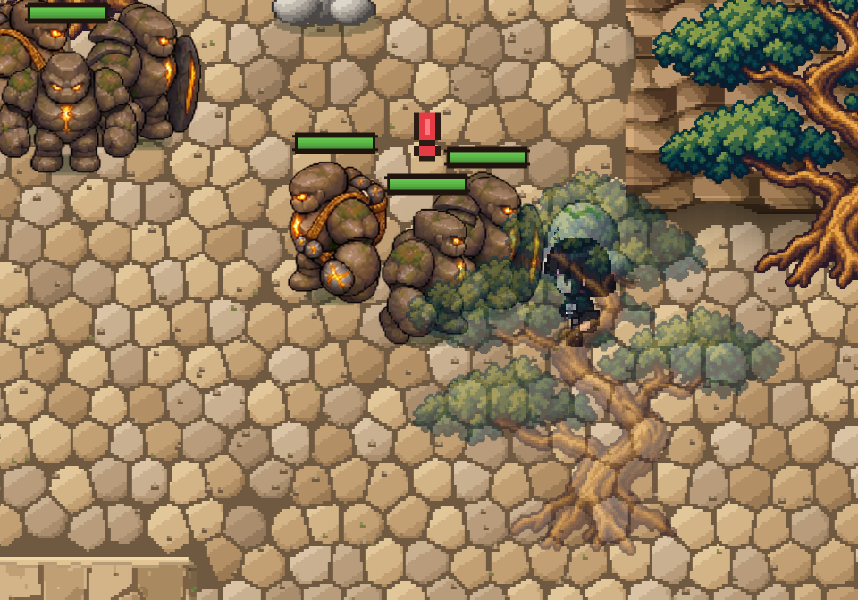
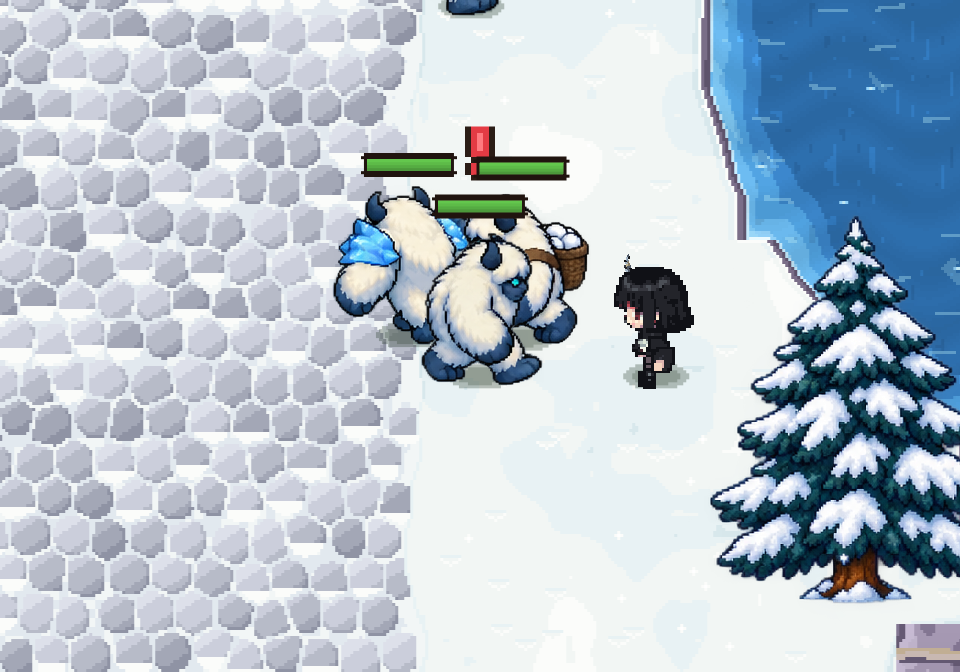
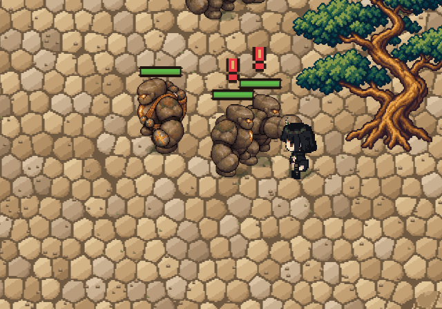
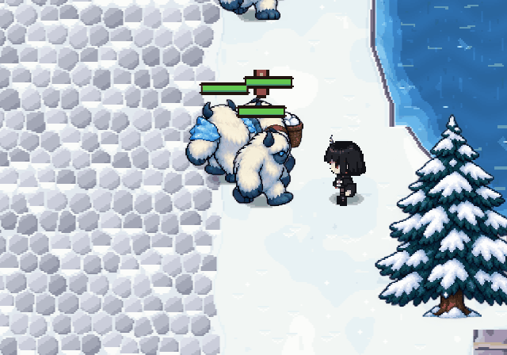

# 암석 골렘 / 설산 예티

협곡·설원 사냥터 각각 기본형, 방패 수호병, 원거리 투척병을 제공한다. 기존 해골의 전투 ID·능력치·드롭·레벨링 규칙은 유지하고 지역 표시 이름과 스프라이트를 교체한다. 보스와 던전 원본 몬스터 정의에는 적용하지 않는다.

`Assets/StreamingAssets/RegionalMonsters/`의 cliff_rock, snow_yeti 및 각 _guard, _thrower PNG/JSON을 사용한다. 각 시트는 5개 방향 행 × idle 2, walk 4, attack 1, hurt 1의 8열이다. 좌우는 기존 캐릭터 렌더러의 방향 체계를 따른다. JSON에 비균일 셀 영역·발 피벗과 96 PPU를 기록하고 Point 필터로 렌더링한다. 투척병은 돌/눈덩이를 발사하며 기존 공격 판정·속도는 유지한다.

기본·방패·투척 외형은 실제 생성된 게임 리소스다. 도감 이미지나 임시 대체물이 아니다. 클라이언트 런타임 검사 300개 통과, 0 실패. 자세한 보고서는 `../World/IMPLEMENTATION.md`, 검사 원문은 `validation.txt`.

