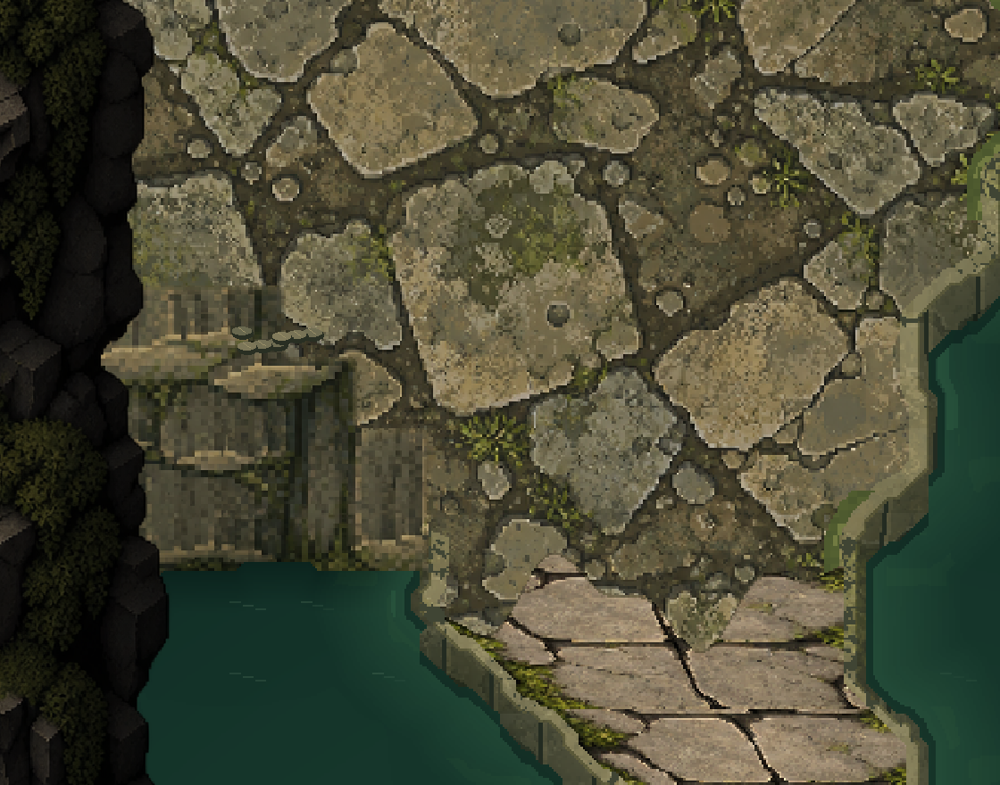
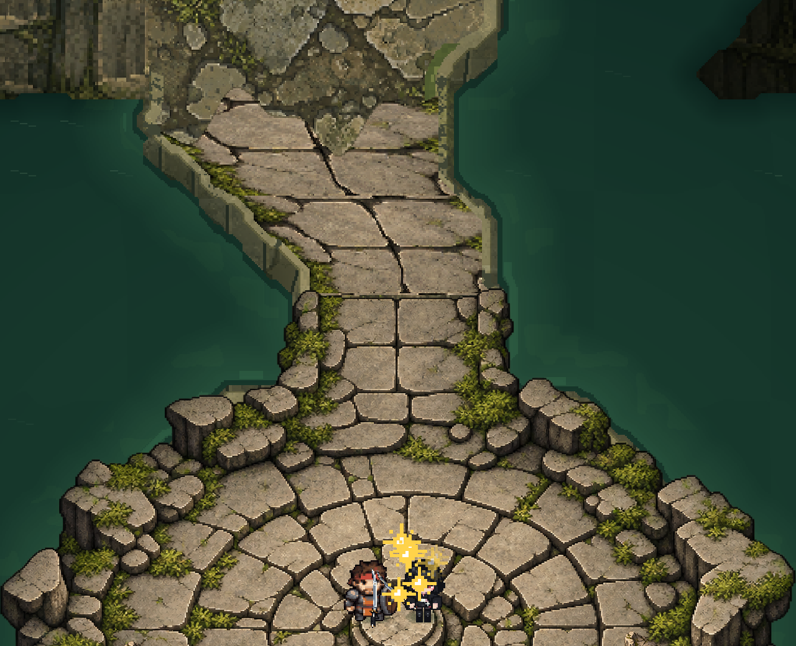
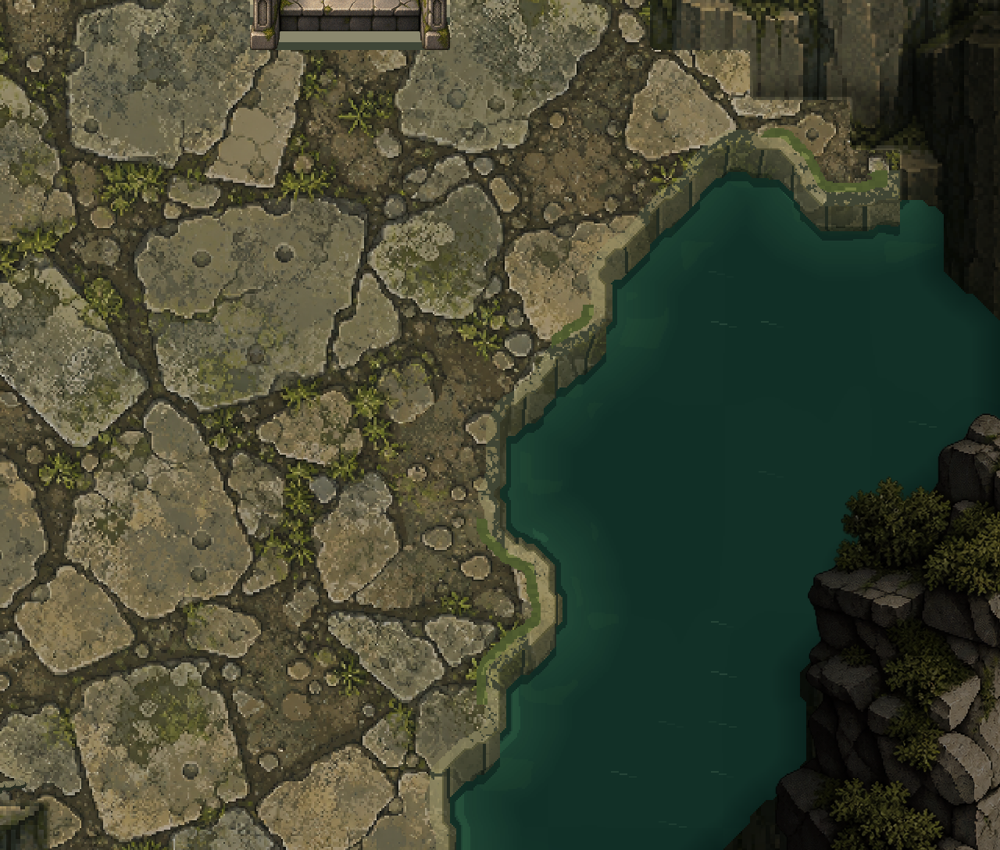
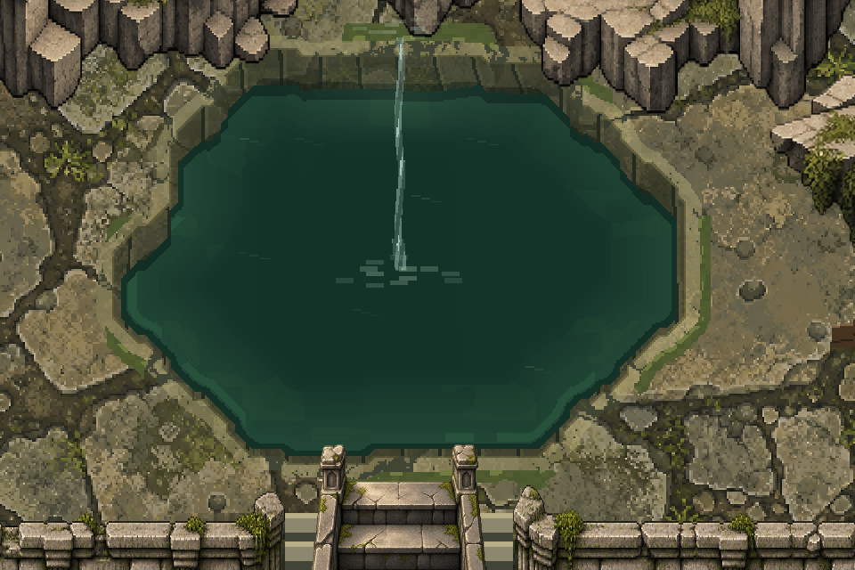
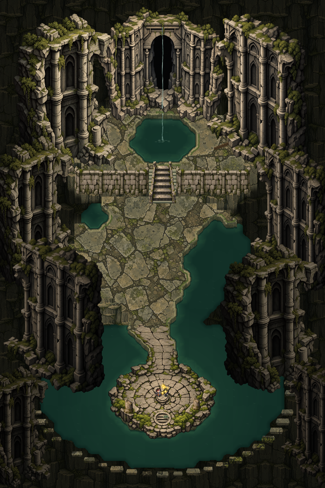
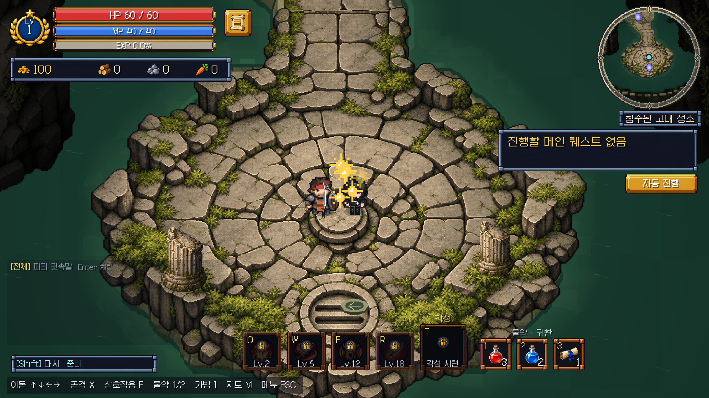
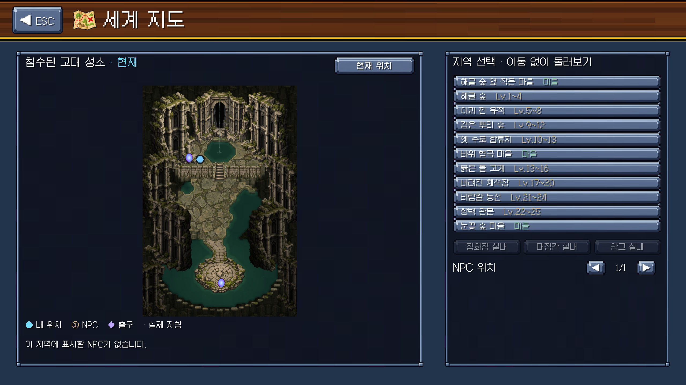
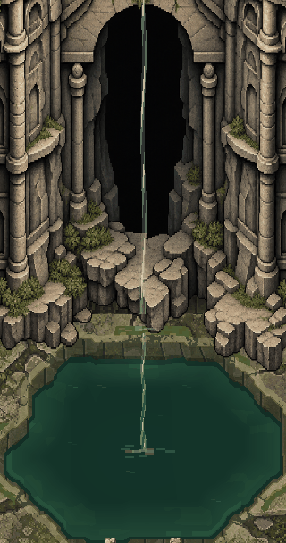
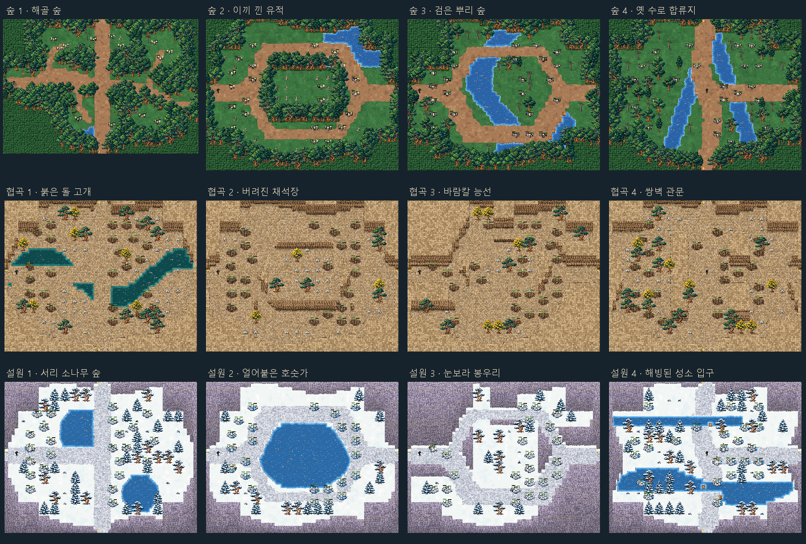

# 침수된 고대 성소와 분기 사냥터

2026-10-05 / jaein 브랜치. 기존 전투 수치·스킬·카메라를 바꾸지 않고 맵 구조와 지역 몬스터 외형을 확장했다.

## 월드 연결

각 지역의 모든 연결은 왕복 가능하다.

| 출발 마을 | 사냥터 1 | 위쪽 사냥터 2 | 아래쪽 사냥터 3 | 합류 사냥터 4 | 다음 지역 |
|---|---|---|---|---|---|
| 해골 숲 옆 작은 마을 | 해골 숲 | 이끼 낀 유적 | 검은 뿌리 숲 | 옛 수로 합류지 | 바위 협곡 마을 |
| 바위 협곡 마을 | 붉은 돌 고개 | 버려진 채석장 | 바람칼 능선 | 쌍벽 관문 | 눈꽃 숲 마을 |
| 눈꽃 숲 마을 | 서리 소나무 숲 | 얼어붙은 호숫가 | 눈보라 봉우리 | 해빙된 성소 입구 | 침수된 고대 성소 |

1의 북쪽 출구는 2, 남쪽은 3으로 향한다. 2와 3은 각각 동쪽 출구로 4에 연결된다. 4에서는 북쪽으로 2, 남쪽으로 3, 동쪽으로 다음 지역에 이동한다. 성소 제단 앞의 작은 귀환 표식은 사냥터 4로 돌아간다. 성소에서 귀환 주문서는 눈꽃 마을로 이동한다. 2→3 직결은 없다.

기존 아홉 사냥터 ID를 유지하고 forest_crossing, canyon_gate, winter_reach를 추가했다. 기존 저장 위치가 새 지형의 물·벽에 겹치면 기존 안전 시작점 복구 규칙을 적용한다. 로드 직후 타일 충돌을 처리하도록 보완했다. 자동 퀘스트 이동은 선형 검색 대신 분기 그래프 BFS를 사용한다.

## 디자인 참고와 재해석

- [Grim Dawn 공식 탐험 안내](https://www.grimdawn.com/guide/gameplay/exploration/): 지역 연결과 우회 탐험 동선 참고.
- [Path of Exile 공식 레벨 디자이너 인터뷰](https://www.pathofexile.com/forum/view-thread/1654235): 서로 다른 전투 공간을 연결하고 환경 테마를 일관되게 유지하는 방식 참고.
- [Hollow Knight 공식 소개](https://www.hollowknight.com/): 깊은 동굴의 어두운 외곽과 중심부 시선 유도 분위기 참고.

타 게임의 이미지·타일을 추출하거나 복사하지 않았다. 숲은 수로·고리 길·식생 장벽, 협곡은 채석장·능선·양쪽 암벽, 설원은 호수·좁은 고개·해빙 수로로 구성했다. 기존 게임 아트를 재사용하며 고정된 지형과 넓은 통행로를 조합했다. 몬스터 캠프는 넓게 분산하고 길과 출입구를 피한다.

## 성소 제작

48×72타일. 텍스트에서 보행 바닥, 계단, 물, 절벽을 분리했다. 상단 아치·좌우 폐허·제단·석재·벽·계단·기둥은 새 PNG 리소스다. 전체 배경 한 장이 아니라 별도 지형, 구조물, 충돌 및 물 애니메이션을 조합한다. 지형은 32px/타일로 그리며 텍스처는 Point 필터를 사용한다.

참고 이미지의 상단 연못, 중앙 오른쪽 연못, 하단 제단 수면을 구분하고 왼쪽 돌길로 이어진다. 불명확했던 제단 북쪽 연결부는 4타일 폭으로 보완했다. 외곽에서 제단으로 건너오는 큰 다리는 추가하지 않았다. 아치는 배경이며 출구가 아니다. 새로운 보스·상점·NPC는 추가하지 않았다.

상단 단상의 정면은 막혀 있고 중앙 계단으로만 올라간다. 계단 옆 난간, 큰 기둥, 갈색 잔해는 충돌하며 낮은 잔돌과 이끼는 장식이다. 높은 폐허는 기존 Y 정렬과 TreeFade를 사용한다. 제단은 바닥 레이어다. 기둥 하부는 충돌로 막혀 있어 몸체를 가로질러 통과할 수 없다.

물은 녹색 깊이 단계와 12프레임 잔물결, 얇은 폭포 두 구간, 포말 및 국소 안개로 구성했다. 움직이는 렌더러는 105개 이하이며 프레임을 공유한다. 재입장 시 월드 루트와 함께 정리한다. 명암은 아트와 지역별 색조로 표현하며 새 전역 조명·높이·카메라 시스템을 넣지 않았다.

## 실제 제작 리소스와 임시 이미지 구분

- `Assets/StreamingAssets/SunkenSanctum/*.png`: 실제 게임에 연결된 생성 아트 8종. 임시 콘셉트 배경이 아니다.
- `SunkenSanctumArt.cs`, `SanctumWater.cs`: 실제 사용하는 지형 합성·물·표식·잔해 렌더링. 코드로 만든 픽셀 아트이며 외부 이미지 대체용 표시가 아니다.
- `Assets/StreamingAssets/RegionalMonsters/*.png`: 암석/예티 각각 기본·방패·투척 6종. JSON은 셀 영역과 피벗 데이터.
- `Docs/World/*.png`, `*.gif`: 실제 엔진 렌더/플레이 화면 또는 그 화면을 묶은 보고용 미리보기. 게임이 이 보고 이미지를 배경으로 읽지 않는다.
- 미완성 임시 이미지 파일은 게임에 연결하지 않았다. 성소 물가는 아래 2026-10-07 보완에서 공유 윤곽과 세분화된 충돌로 갱신했다.

## 주요 코드와 데이터

- `World/WorldRoutes.cs`: 세 지역의 1-2-1 연결과 방향별 출구.
- `World/HuntingLayouts.cs`, `HuntingGrounds.cs`: 사냥터 윤곽·길·장식·캠프 및 새 지역 레벨.
- `World/MapRegistry.cs`, `WorldBuilder.cs`, `WorldBuilder.SunkenSanctum.cs`: 등록, 포털, 충돌, 월드 생성.
- `Resources/Maps/SunkenSanctum.txt`: 성소 지형. StreamingAssets의 layout.txt는 로컬 기존 플레이어용 동일 사본.
- `Art/SunkenSanctumArt.cs`, `World/SanctumWater.cs`: 성소 아트와 애니메이션.
- `Art/RegionalMonsterArt.cs`: 지역별 역할 스프라이트와 투사체.
- `Quest/QuestAutoPilot.cs`: 분기 경로 탐색.
- `World/WorldAtlas.cs`, `UI/WorldMapScreen.cs`: 새 맵 목록·출구·지도 표시.
- `server/data/maps.json`, 데이터 버전 파일: 실제 생성된 필드 수·경계·몬스터 수·자원 노드 반영. 서버 실행 코드는 변경하지 않았다.

## 검증 결과

- C# 런타임 컴파일 성공. 기존 경고는 남아 있다.
- 분기/포털 195 통과, 0 실패: 12개 필드, 모든 출구 접근, 도착 지점, 실제 15회 포털 전환과 되튕김 방지.
- 지역 몬스터 300 통과, 0 실패: 6종×40셀, Point 필터, 12개 필드 외형·레벨·XP·원본 정의 유지 및 돌/눈덩이 투사체.
- 성소 37 통과, 0 실패: 48×72, 물/절벽 충돌, 전용 아트 8종, 실제 제단→단상 보행, 동료 추종, 재입장 정리, 무음.
- 사냥 회귀 146 통과, 0 실패: 필드 캠프·처치 XP·재생성, 던전 효율 하한 등. 동료 검증은 테스트에서만 용병을 소환했으며 일반 야외 용병 규칙은 유지했다.
- 서버 필드 테스트 25개 중 20 통과, 5 실패. fieldJobs는 통과. fieldSessions의 경험치 20 고정값 2건, 공급 상한/화력 상한 고정 기대 2건, 중계 방 ROOM_NOT_FOUND 1건 실패. 클라이언트에 이미 적용된 3마리 팩·1마리 XP 7을 서버 데이터에 동기화하면서 이전 기대값과 차이가 드러났다. 중계 방 실패 원인과 실제 두 클라이언트 온라인 플레이는 이번 범위에서 검증하지 못했다.
- Unity 에디터의 새 전체 플레이어 빌드는 라이선스 문제로 검증하지 못했다. 기존 로컬 플레이어의 런타임 DLL과 StreamingAssets를 갱신하여 실행했다. 원격 서버 배포·git push는 하지 않았다.
- 모든 실행 검증은 오디오 볼륨 0이었다.

## 로컬 확인

바탕화면 `dotRPG 침수된 고대 성소.lnk` 실행. 방향키 이동, X 공격, Shift 이동기, M 지도. 테스트 캐릭터는 성소 제단에서 시작하며 별도 saves 폴더를 사용하므로 일반 저장 슬롯을 덮어쓰지 않는다. 일반 플레이에서도 눈꽃 사냥터 4의 동쪽 출구로 도달할 수 있다.

## 2026-10-07 성소 물가 개선

레퍼런스의 밝은 돌 윗면 → 어두운 젖은 절벽 면 → 얕은 녹색 물 → 깊은 수면 순서로 경계를 다시 그렸다. 기존 큰 아치, 건축물, 제단, 계단과 주 동선은 유지했다.

- `World/SunkenSanctumShore.cs`: 48×72 레이아웃을 타일당 8×8 공유 마스크로 세분화하고, 모서리를 연결한다. 원본 W 절벽의 통행 금지, 계단 및 포털·시작 타일은 유지한다. 전체 마스크의 거리 필드로 수심을 계산해 타일별 색 띠를 없앴다.
- `Art/SunkenSanctumArt.Shore.cs`: 32px/타일 지형을 실제 생성한다. 돌턱, 갈라진 수직 면, 접촉 그림자, 국소 이끼와 얕은 반사를 같은 윤곽에 배치한다. 보행 윗면과 물 쪽으로 내려가는 비보행 벽면을 구분한다. 사각 조명 패치를 제단과 상단 연못 중심의 연속적인 밝기로 교체했다.
- `WorldBuilder.SunkenSanctum.cs`: 같은 마스크의 물 충돌을 하나의 정적 CompositeCollider2D로 합친다. 그림의 윤곽은 32px 해상도로 보간하며 1/8타일 충돌과의 코너 차이는 2px 미만이다. 물가 세분화는 이 맵에만 적용한다.
- `SanctumWater.cs`: 성소 돌턱·젖은 벽면 위에 잔물결이 겹치지 않도록 제한했다. 기존 다른 성소 사냥터는 종전 동작을 사용한다.

실행 확인: C# 컴파일 성공, 성소 검사 **41 통과 / 0 실패**. 물 쪽 628개 점의 실제 충돌, 캐릭터 충돌 원이 들어갈 수 있는 땅 쪽 302개 점, 10개 경유점의 실제 이동, 동료 추종, 퇴장·재입장 후 물 및 충돌 중복 방지를 확인했다. 초기 검사에서 음영용 근사 거리를 발 반지름 검사에 사용한 오차가 있어, 정확한 셀 사각형과 원의 거리로 검사를 보완했다. 전 과정 볼륨은 0이었다. 최종 로그는 `sanctum-validation.txt`다.

로컬 기존 플레이어의 런타임 DLL과 StreamingAssets를 갱신하여 검증했다. 이번에는 새 Unity 전체 플레이어 빌드와 실제 온라인 파티 접속을 검증하지 않았다. 로컬 플레이어에는 기존 뽑기 배너 5종 누락 경고가 남으며 성소 리소스/충돌 오류는 최종 실행에서 없었다. 기본 저장 슬롯을 사용하지 않는 바탕화면 `dotRPG 침수된 고대 성소.lnk`로 확인할 수 있다.

### 제단 진입로와 서쪽 절벽 접합부 추가 수정

사용자 플레이 화면의 검은 구간은 X15–19 / Y24–28 부근의 통행 불가 W 지형이었다. 바닥 이미지를 어둡게 재사용해 평평한 검은 땅처럼 보이던 표현을 실제 수직 암벽 재질과 높이에 따른 명암으로 교체했다. 보행 바닥 아래의 암석 결, 좁은 깨진 모서리, 물과 만나는 젖은 하부를 연결하고 전경 폐허의 과도한 검정 색조도 완화했다. W 충돌은 유지한다.

제단 북쪽 석재 입구는 X24 부근, 기존 돌길은 X22 부근으로 중심이 달랐다. 하단 7개 행의 돌길을 제단 입구 방향으로 굽히고 Resources/StreamingAssets의 레이아웃을 함께 갱신했다. `SunkenSanctumArt.Approach.cs`가 기존 제단의 보행 석판 부분을 아틀라스로 사용해 길까지 이어 그린다. 제단 중심, 시작점, 귀환 포털과 원본 제단 PNG는 유지한다. 그림만 덮은 것이 아니라 공유 마스크를 통해 물 충돌도 새 동선에 맞는다. 별도 로컬 플레이어에서도 그림과 레이아웃 버전이 맞도록 성소 아트와 함께 배포되는 layout.txt를 우선 읽는다.

새 실제 게임 리소스: `Assets/StreamingAssets/SunkenSanctum/cliff_face.png`. built-in `image_gen`으로 제작했으며 [전체 생성 프롬프트](sanctum-cliff-prompt.json)를 보존했다. 핵심 요청은 “회갈색·올리브색의 젖은 고대 성소 수직 암벽, 큰 파손 면과 세로 균열, 바닥/수면/UI 없는 픽셀 아트 재질”이다. 테스트용 대체 이미지가 아니다.

추가 검증: 새 암벽 리소스 로딩, W 절벽 통행 차단, 정렬된 제단 입구 4개 지점의 보행 가능 여부와 기존 전 구간 이동·동료 검사를 포함해 **47 통과 / 0 실패**. 음량은 0으로 유지했다. 기존 로컬 플레이어 DLL·성소 아트·레이아웃을 갱신했다. 전체 새 Unity 빌드와 온라인 파티 접속은 이번에도 검증 범위에 포함하지 않았다.

변경 전 전체 맵: [이전 물가](sanctum-shore-before.png). 아래 PNG/GIF는 변경 후 실제 엔진 화면이다. GIF는 촬영한 24프레임을 인코딩한 확인용 자료이며 게임 리소스가 아니다.

