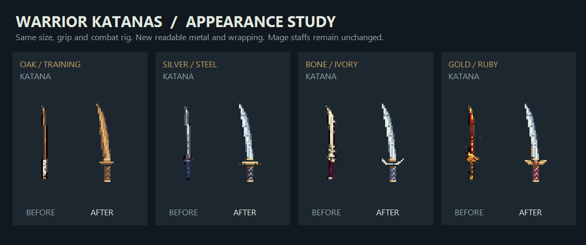

# Warrior katana appearance, revision 3

The four equipped warrior weapon sprites were redrawn in editable pixel-art code and exported as transparent PNGs. These are completed in-game assets, not concept mockups or temporary placeholders. The mage's staff artwork and original loading path are unchanged. The existing four visual tiers remain unchanged; equipment items in the same visual tier continue to share a sprite.

| Tier | Appearance |
| --- | --- |
| 0 | Curved oak training blade, visible wood grain and simple bronze guard |
| 1 | Silver cutting edge, separate steel bevel and temper line, brass guard and charcoal grip wrapping |
| 2 | Cold steel blade, open ivory guard and indigo wrapping |
| 3 | Gold fittings, ruby guard inset, wine-red wrapping and engraved steel blade |

## Integration

- Source: `Assets/Scripts/Runtime/Art/PlayerWeaponArt.cs` and `PlayerWeaponArt.Runtime.cs`.
- PNG assets: `Assets/Resources/Art/PlayerWeapons/wpn_sword_0..3.png`.
- `SpriteLibrary` resolves only those four exact held-katana keys through this dedicated art family. Mage staffs, item-specific inventory icons and other weapon families retain their previous resource resolution.
- The PNG path takes priority over the deterministic native fallback. Older local player bundles therefore show the same katana artwork without a resource reimport.
- Katana canvas: 64×64, 40 pixels/unit, grip pivot `(32, 11.5)` measured from the bottom left.
- Per the final user instruction, the four new katana images are reflected horizontally about the x=32 grip pivot. This changes the blade's visual side only; right-hand attachment, body appearance and direction-dependent flip rules remain unchanged.
- Pixels are transparent or fully opaque. Sprites use nearest-neighbour filtering, no mipmaps, and readable texture data for existing enhancement masks.

Combat numbers, range, motion, timing, equipment IDs, handedness and enhancement rules are unchanged. The artwork adds no animated glow. Existing +7 blue light and +11 aura continue to sample the new silhouettes.

## Reproduction

On Windows with PowerShell 7:

```powershell
./Tools/art/preview_player_weapons.ps1 -BakeProject
```

This compiles the actual pixel-art source against a minimal colour struct, exports four PNGs and creates `weapon-before-after.png`. Existing PNG GUIDs are preserved. Unity imports the original grip pivot and pixel density.

Native silent runtime verification:

```text
dotRPG.exe -batchmode -dotrpgWeaponAppearance <output-folder>
```

The explicit development mode uses isolated saves and volume zero. It verifies equipment-tier selection, katana dimensions/pivots, opaque grips, readable point-filtered sources, all eight warrior right-hand directions, attack attachment, direction-dependent flips, +0/+6/+7/+10/+11/+12 enhancement levels, effect alignment and cleanup on unequip. For all four mage staff tiers it independently resolves the original resource/procedural source and compares visible pixels and sprite geometry, including while attacking.

Paired warrior before/after shots use the identical live body pose. Mage captures are named `Mage_tier*_unchanged.png`. A fresh Unity resource-imported full build was not run by this check; the standalone uses the same deterministic katana source as the exported PNGs.



Verified 2026-10-08 after the final katana reflection: complete runtime source compilation passed; native silent capture passed **115 checks, 0 failures**. See report.txt and the native equipped screenshots in this folder. Mage original pixels and geometry matched in all four tiers and during attacks.
