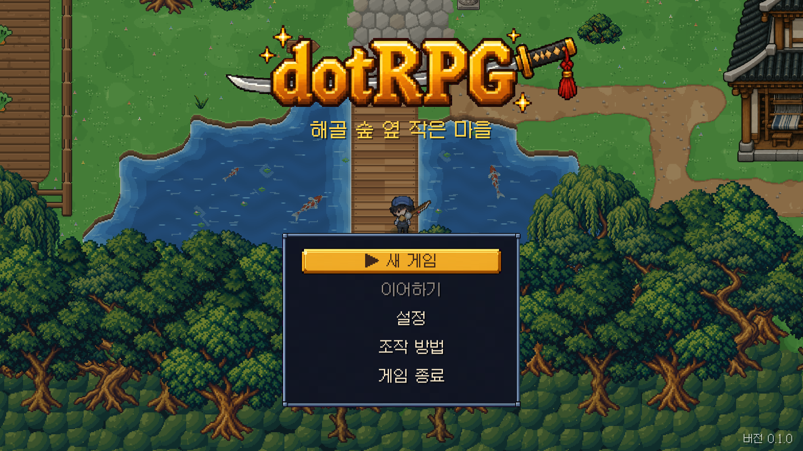
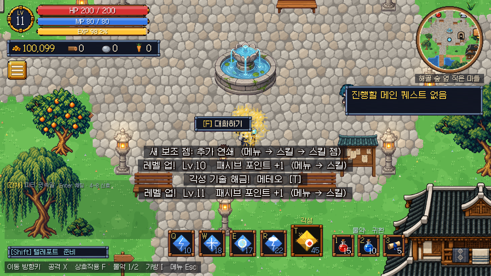

# dotRPG - 해골 숲 옆 작은 마을 (Unity 2D RPG 세로 슬라이스)

도트 탑다운 **2D 액션 RPG**입니다. 불타는 마굿간에서 가족과 친구를 잃은 일꾼이 스승 카엘과 함께 검을 들고,
요일 던전·레이드·강화로 성장하며 챕터 1~2의 이야기를 따라갑니다.




- 스토리: [`Docs/STORY.md`](Docs/STORY.md) · 진행 체크리스트: [`Docs/MASTER_CHECKLIST.md`](Docs/MASTER_CHECKLIST.md)
- 던전·레이드: [`Docs/PLAN_DUNGEON_RAID.md`](Docs/PLAN_DUNGEON_RAID.md) · 온라인 구조: [`Docs/PLAN_ONLINE.md`](Docs/PLAN_ONLINE.md) · 경매장: [`Docs/PLAN_AUCTION.md`](Docs/PLAN_AUCTION.md)
- 게임 서버: [`Docs/PLAN_SERVER.md`](Docs/PLAN_SERVER.md) · 단계별 명세 [`Docs/server/`](Docs/server/) · 서버 운영 런북 [`server/ops/README.md`](server/ops/README.md)
- 스토어 소개 문구: [`Docs/STORE.md`](Docs/STORE.md)

---

## 1. 엔진 및 버전

| 항목 | 선택 |
|---|---|
| Unity | **6000.5.9f1** (`ProjectSettings/ProjectVersion.txt`) |
| 렌더링 | Built-in 렌더 파이프라인, 2D 스프라이트 + Tilemap (정렬은 파이프라인과 무관한 `sortingOrder` 기반) |
| UI | uGUI, 코드로 생성. 폰트 Galmuri11(OFL, `Resources/Fonts/UIFont.ttf`) |
| 입력 | 레거시 Input Manager(현재 설정). Input System 경로도 코드에 남아 있음. 키보드 키는 게임 안에서 변경 가능 |
| 언어 | C# 9 (Unity 기본) |

## 2. 실행 방법

1. Unity Hub에서 **Unity 6000.5.9f1** 설치.
2. Unity Hub ▸ **Add ▸ Add project from disk** ▸ 이 저장소 폴더 선택 후 열기.
   - 처음 열면 패키지를 내려받고 스크립트를 컴파일합니다(수 분).
   - "새 Input System 백엔드를 활성화할까요?" 창이 뜨면 **Yes**를 누르고 에디터를 재시작하세요.
     (No를 눌러도 레거시 입력으로 키보드/게임패드가 동작합니다.)
   - 첫 실행 시 `dotRPG ▸ Apply Project Settings`가 자동 실행되어 제품명·창 설정·빌드 씬 목록이 적용됩니다.
3. `Assets/Scenes/Main.unity`를 열고 **Play**.
   - 빈 씬에서 Play를 눌러도 부트스트랩이 자동 생성되어 게임이 시작됩니다.
4. PC 빌드: 메뉴 **dotRPG ▸ Build ▸ Windows (x64)** → `Builds/Windows/dotRPG.exe`
   - 명령줄: `Unity -batchmode -quit -projectPath . -executeMethod DotRPG.EditorTools.BuildScript.BuildWindows`

## 3. 조작법

| 동작 | 키보드 | 게임패드 |
|---|---|---|
| 이동 (8방향, 4방향 애니메이션) | 방향키 | 왼쪽 스틱 / 십자키 |
| 공격 · 채집 (검 휘두르기) | X | X (서쪽 버튼) |
| 이동기 (전사 대시 / 마법사 텔레포트) | Shift (좌/우 모두) | B (동쪽 버튼) |
| 대화 · 상호작용 | F | A (남쪽 버튼) |
| 체력 물약 (없으면 당근) | 1 | Y (북쪽 버튼) |
| 마나 물약 | 2 | L3 |
| 귀환 주문서 | 3 | - |
| 스킬 1~5 (5번은 각성) | Q / W / E / R / T | LB / RB / LT / RT / R3 |
| 가방 · 장비 | I / Tab | Back |
| 채팅 열기 · 보내기 / 닫기 | Enter · Esc (`/p` 파티, `/g` 일반, `/w 이름` 귓속말) | - |
| 빠른 신호 (모여 · 부활해 줘 · 기믹 위치 · 준비 완료 · 고마워) | 4 ~ 8 | - |
| 일시정지 메뉴 | Esc | Start |
| 메뉴 선택 / 결정 / 취소 | 방향키 · Enter/Space/F/X · Esc | 스틱 · A · B |

마우스로도 메뉴 항목을 클릭할 수 있습니다(옵션 항목은 좌클릭 +, 우클릭 −).
키보드 키는 **설정 ▸ 조작 키 변경**에서 바꿀 수 있습니다(이미 쓰는 키를 고르면 두 동작의 키가 서로 바뀜). 방향키·Esc·게임패드 버튼은 고정입니다.
빠른 신호 키(4~8)는 다른 동작에 배정하면 그 동작이 우선합니다.

이동기는 이동 입력 방향으로, 정지 중에는 마지막으로 바라본 방향으로 발동합니다.
전사는 0.18초 동안 최대 2.8타일 대시(쿨타임 1.4초), 마법사는 최대 3.5타일 순간이동(쿨타임 2초)합니다.
8방향 이동 거리는 같으며 벽·물·장애물 앞에서 멈춥니다. MP 소모와 무적 효과는 없으며,
Shift를 누를 때마다 한 번 발동합니다. 화면 왼쪽 아래에서 준비 상태와 남은 쿨타임을 확인할 수 있습니다.
시전·경직·귀환 주문서 사용 중에는 발동하지 않습니다. 기본 공격 중에는 공격을 취소하고 이동합니다.
자동 검증: 빌드 실행 시 `-dotrpgMobility <결과 폴더>`를 추가하면 별도 저장 경로로 이동·충돌·입력 검증과 화면 캡처를 실행합니다.

## 4. 플레이 흐름

1. 타이틀 ▸ **새 게임** ▸ 저장 슬롯(3개) ▸ 직업(전사·마법사)과 이름 → 프롤로그 "마굿간의 아침".
2. 챕터 1(잿더미의 마굿간): 축제 전야 → 불타는 밤(강제 패배 컷신) → 잿더미 → 카엘과 수련 → 마을 복구 → 해골 숲 추적.
3. 성장 구간: 광장의 던전 안내원에게서 **요일 던전**(하루 3회, 주말엔 전부 개방). 사냥·강화·패시브 트리·보조 젬.
4. **중간 레이드 해골왕**(수·토·일, 하루 1회 보상): 2페이즈 사령 토템 2개를 함께 부숴야 하고, 3페이즈 "망자의 심판"은 때려서 끊어야 한다. 보상으로 봉인 열쇠 조각.
5. 조각 100개로 **일요일 최종 레이드 흑철의 바르가스**. 이후 챕터 2(바위 협곡) 해금.
6. 메뉴(왼쪽 위 버튼): 가방·스킬·지도·퀘스트·요일던전·레이드·파티·파티 찾기·경매장·친구. 일시정지 메뉴에 도움말.

**오프라인과 온라인은 따로입니다.** 새 게임·이어하기는 이 PC의 저장 파일로 하고, 타이틀의 **온라인**은 서버 계정의 캐릭터로 합니다(서버가 골드·아이템·경험치를 판정). 오프라인에서는 파티 찾기·경매장·채팅·친구가 미리보기(목업 데이터)로 동작하고, 온라인 캐릭터로 접속하면 실제 서버에 붙습니다.

### 온라인으로 해 보기 (개발 PC)

1. 서버: `cd server` 후 `npm install`(처음 한 번), `.env.example`을 `.env`로 복사하고 `JWT_SECRET`을 채운 뒤 `npm run dev` (내장 PostgreSQL과 마이그레이션까지 자동, 포트 3000)
2. 게임: 타이틀 ▸ **온라인** ▸ 아이디·비밀번호로 **새 계정 만들기** ▸ 캐릭터 만들기 ▸ 접속. 다른 서버 주소는 실행 인자 `-dotrpgServer http://주소:3000`
3. 둘이 파티(같은 PC 창 2개): 창마다 다른 계정으로 접속 ▸ 한쪽이 파티 찾기에서 모집 글 ▸ 다른 쪽이 참가 신청 ▸ 방장이 수락 후 파티 창에서 **출발**. 싸움 연결은 개발용 UDP(127.0.0.1)라 지금은 같은 PC의 창 2개만 됩니다(Steam P2P는 시험 앱 ID 확보 후)
4. 서버 없이 창 2개 협동만 볼 때: 실행 인자 `-dotrpgParty host` / `-dotrpgParty join`

## 5. 프로젝트 구조

```
Assets/
  Scenes/Main.unity                 GameBootstrap 한 개만 있는 진입 씬
  Resources/
    Data/GameConfig.asset           루트 설정 (아래 에셋들을 참조)
    Data/PlayerStats.asset          이동속도, 체력, 공격 수치 …
    Data/SkeletonStats.asset        해골 체력, 감지 범위, 공격 예고 시간 …
    Data/QuestConfig.asset          의뢰 요구량, 보상, 관련 NPC/대사 id
    Data/Dialogues.json             모든 대사 (현지화 단위)
    Maps/Village.txt                맵 레이아웃 (문자 1개 = 타일 1개, 범례는 파일 머리말)
  Scripts/Runtime/  (DotRPG.Runtime.asmdef)
    Core/        Game(서비스 접근), GameBootstrap(초기화 순서), GameFlow(타이틀→플레이→일시정지→종료),
                 GameState(상태·timeScale), GameSession(저장 대상 상태), Inventory, YSort, GameEvents
    Data/        ScriptableObject 정의 (GameConfig, PlayerStats, EnemyStats, QuestConfig, NpcDefinition)
    Input/       InputReader - 액션 기반 입력, Input System/레거시 이중 지원, 바인딩 저장
    Player/      PlayerController(이동·피격), PlayerCombat(검), PlayerInteractor, CharacterAnimator
    Combat/      Health, DamageInfo/IDamageable, HitFlash, Fx(파티클)
    Enemies/     EnemyController(해골 AI 상태 머신), EnemySpawner(리스폰)
    NPC/         NpcController(대기·배회·순찰·작업)
    Interaction/ Interactable 기반 클래스, ConstructionSite, CropPlot, ResourceNode, Pickup, DialogueInteractable
    Dialogue/    DialogueDatabase(JSON), DialogueManager(타자기 효과·진행)
    Quest/       QuestManager, QuestJournal, CutscenePlayer, StoryCast (데이터: Resources/Data/Quests.json 등)
    Dungeon/     DungeonDatabase(요일 던전·레이드), DungeonDirector(입장·방·부활·결과), ResetClock
    Party/       PartyManager, CompanionBrain(역할별 AI)
    Net/         Transport(루프백·UDP), NetPresence, PartyFinder/Auction/Chat 서비스(목업), Authority
    World/       WorldBuilder (텍스트 맵 → Tilemap + 오브젝트)
    CameraSystem/CameraFollow (정수 배율 픽셀 카메라, 추적, 흔들림, 타이틀 드리프트)
    Art/         ProceduralArt(임시 픽셀아트), SpriteLibrary(Resources 교체), PixelCanvas, CharacterLook
    Audio/       AudioManager, SfxSynth(임시 효과음·배경음 합성)
    UI/          UIRoot(화면 스택), HudView, DialogueBoxView, MenuList, MenuScreens, ScreenFader, UIFactory
    Save/        SaveData, SaveSystem
    Settings/    SettingsData, SettingsManager
  Scripts/Editor/   (DotRPG.Editor.asmdef)
    ProjectSetup    PC 플레이어 설정 적용
    BuildScript     Windows/macOS/Linux 빌드
    DevTools        저장 폴더 열기/삭제, 임시 스프라이트 PNG 내보내기
Packages/manifest.json
ProjectSettings/ProjectVersion.txt, EditorBuildSettings.asset
Tools/
  art/            생성 이미지 절단·임포트 준비(process_*.py)
  balance/        이론 밸런스 계산(theory_balance.py)
  story/          퀘스트·컷신·대사 데이터 생성
  generate_meta.py  에디터 없이 만든 에셋의 .meta 생성기
Docs/             설계 문서, 에셋 가이드, 미리보기 이미지
```

### 설계 원칙
- **수치는 데이터에**: 속도·체력·쿨다운·요구량·리젠 시간 등은 `Resources/Data/*.asset`에서 Inspector로 조정. 대사는 JSON, 맵은 텍스트.
- **교체 가능한 임시 에셋**: 스프라이트는 `Resources/Art/{키}.png`, 사운드는 `Resources/Audio/{키}`, 폰트는 `Resources/Fonts/UIFont`를 넣으면 코드 수정 없이 교체.
- **입력은 한 곳에서만**: 게임 코드는 키를 직접 읽지 않고 `Game.Input.AttackPressed` 등만 사용 → 키 변경·Steam Input 확장이 쉬움.
- **상태 한 곳에서만**: `GameStateMachine`이 `Time.timeScale`과 UI 표시를 결정.

## 6. 구현된 기능

- **이야기**: 챕터 1~2 메인 퀘스트(데이터 기반 `Quests.json`·`Cutscenes.json`·`StoryDialogues.json`), 컷신 타임라인, 스토리 동료 카엘의 합류·이탈, 서브 퀘스트, 퀘스트 창·알리미·머리 위 `!`/`?` 표시
- **전투**: 전사·마법사, 스킬 4개 + 각성, 직업별 이동기, 패시브 트리·보조 젬, 보스 패턴과 바닥 경고 범위(색약 보정 시 보라·흰색)
- **던전·레이드**: 요일 던전 5종 × 난이도 4단계, 방 진행·부활·랭크·보상 카드, 레이드 4종(중간 해골왕·골렘, 최종 바르가스·그라흐), 봉인 열쇠 조각, 주간·요일 초기화
- **성장·경제**: 레벨·장비·강화(+10부터 파괴 위험, 보호권, 망치 세 번 연출과 결과 효과음), 상점·창고, 재료, 귀속 규칙 표시(거래 가능·계정 귀속·캐릭터 귀속)
- **파티**: 용병 고용 최대 4인, 역할별 AI(탱커·딜러·힐러), 레이드 토템 분담
- **온라인(서버 연결)**: 개발용 로그인, 온라인 캐릭터, 서버 판정 경제(처치·드롭·채집·퀘스트 보상·상점·강화·창고·장착·던전 보상), 파티 모집·자동 매칭·로비와 협동 던전(방장 PC 계산 + 스냅샷 동기화, 방장 인계), 레이드 보상 판정, 실시간 채팅·친구·차단·신고·파티 초대, 경매장·우편·시세. 서버가 없거나 오프라인 캐릭터면 같은 창들이 미리보기로 동작
- **게임 서버(`server/`)**: Node 22 + TypeScript + Express 5 + PostgreSQL, WebSocket 채팅, 마이그레이션 0001~0008, 자동 테스트 442개, 관리자 CLI(2단계 인증·감사 로그), 정리 작업·백업·점검 공지, Docker·Caddy 배포 파일
- **편의**: 저장 슬롯 3개, 저장 손상 안내, 키 변경, 글자·UI 크기 4단계, 색약 보정, 화면 흔들림 끄기, 첫 방문 안내 팁, 도움말
- **아트**: 생성 도트 캐릭터(64px, 머리:몸 1:1), 마을·협곡·겨울 소품, 아이콘·로고·던전 배너, 9-slice 창 프레임

## 7. 자동 검증 (DevCapture)

빌드 실행 파일에 모드 인자와 결과 폴더를 주면, 진행 저장을 건드리지 않고 시나리오를 돌려 `report.txt`에 PASS/FAIL과 화면 캡처를 남깁니다.

```
dotRPG.exe -dotrpgStory   <폴더>   # 챕터 1~2 퀘스트·컷신
dotRPG.exe -dotrpgDungeon <폴더>   # 요일 던전·레이드·보스 바·자동 클리어
dotRPG.exe -dotrpgParty   <폴더>   # 파티 AI·부활·전멸
dotRPG.exe -dotrpgOnline  <폴더>   # 전송·권한 분리·파티 찾기·경매장·채팅
dotRPG.exe -dotrpgUi      <폴더>   # 화면별 UI 캡처
dotRPG.exe -dotrpgBalance <폴더>   # 난이도별 클리어 시간
dotRPG.exe -dotrpgPerf    <폴더>   # 마을·던전 전투 fps와 GC
dotRPG.exe -dotrpgNetPair <폴더> -dotrpgNet host   # 창 2개: 하나는 host,
dotRPG.exe -dotrpgNetPair <폴더> -dotrpgNet join   #         하나는 join
```

## 8. 아직 하지 않은 것

- 서버 실제 배포(업체·도메인 미정). 배포 절차는 `server/ops/README.md`에 준비되어 있음
- Steamworks 연결(로그인·P2P 전송·도전과제·클라우드). 서버의 Steam 인증은 mock까지, 클라이언트 P2P 전송은 시험 앱 ID 확보 후
- 창 2개 협동 실제 플레이 확인(코드·서버 흐름만 검증됨), 현지화(영어)
- 챕터 3~5

## 9. 저장 데이터 위치

`Application.persistentDataPath` (Windows: `%USERPROFILE%\AppData\LocalLow\dotRPG Team\dotRPG\`)
- `Saves/slot_0.json` ~ `slot_2.json` (+ `.bak`) - 게임 진행(슬롯 3개)
- `settings.json` - 설정 (진행과 분리)

에디터 메뉴 **dotRPG ▸ Save Data**에서 폴더 열기/삭제가 가능합니다.
