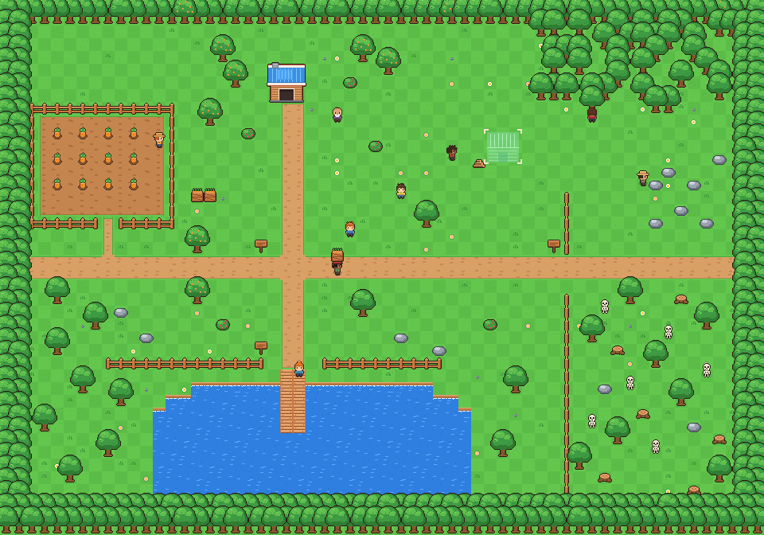

# dotRPG — 해골 숲 옆 작은 마을 (Unity 2D RPG 세로 슬라이스)

밝은 16px 탑다운 픽셀아트 레퍼런스의 분위기를 바탕으로 만든 **직접 조작 가능한 2D 액션 RPG 프로토타입**입니다.
촌장의 의뢰를 받아 나무·바위를 채집하고, 해골을 물리치고, 멈춰 있던 마을 공방을 다시 짓는 약 5분 분량의 완결된 구간을 담았습니다.



> 위 이미지는 Unity 실행 화면이 아니라, 게임과 **같은 아트 생성 코드**로 맵을 합성한 오프라인 미리보기입니다 (`Tools/ArtPreview`).
> 모든 그래픽·사운드는 코드로 직접 생성한 임시 에셋이며, 레퍼런스 이미지의 에셋은 사용하지 않았습니다.

- 설계 문서(레퍼런스 분석, 콘셉트, 핵심 루프, 출시 준비 구분): [`Docs/DESIGN.md`](Docs/DESIGN.md)
- 에셋 교체 가이드: [`Docs/ASSETS.md`](Docs/ASSETS.md)

---

## 1. 엔진 및 버전

| 항목 | 선택 |
|---|---|
| Unity | **Unity 6.3 LTS — 6000.3.24f1** (`ProjectSettings/ProjectVersion.txt`). 코드는 Unity 6000.0 이상에서 동작하도록 작성 |
| 렌더링 | Built-in 렌더 파이프라인, 2D 스프라이트 + Tilemap (정렬은 파이프라인과 무관한 `sortingOrder` 기반) |
| UI | uGUI (`com.unity.ugui` 2.0.0) — 코드로 생성 |
| 입력 | Input System (`com.unity.inputsystem` 1.14.0). 레거시 Input Manager로도 동작하도록 이중 구현 |
| 언어 | C# 9 (Unity 기본) |

## 2. 실행 방법

1. Unity Hub에서 **Unity 6000.3.x LTS** 설치 (다른 6000.3 패치 버전이어도 됩니다).
2. Unity Hub ▸ **Add ▸ Add project from disk** ▸ 이 저장소 폴더 선택 후 열기.
   - 처음 열면 패키지를 내려받고 스크립트를 컴파일합니다(수 분).
   - "새 Input System 백엔드를 활성화할까요?" 창이 뜨면 **Yes**를 누르고 에디터를 재시작하세요.
     (No를 눌러도 레거시 입력으로 키보드/게임패드가 동작합니다.)
   - 첫 실행 시 `dotRPG ▸ Apply Project Settings`가 자동 실행되어 제품명·창 설정·빌드 씬 목록이 적용됩니다.
3. `Assets/Scenes/Main.unity`를 열고 **Play**.
   - 빈 씬에서 Play를 눌러도 부트스트랩이 자동 생성되어 게임이 시작됩니다.
4. PC 빌드: 메뉴 **dotRPG ▸ Build ▸ Windows (x64)** → `Builds/Windows/dotRPG.exe`
   - 명령줄: `Unity -batchmode -quit -projectPath . -executeMethod DotRPG.EditorTools.BuildScript.BuildWindows`

## 3. 조작법

| 동작 | 키보드 | 게임패드 |
|---|---|---|
| 이동 (8방향, 4방향 애니메이션) | 방향키 | 왼쪽 스틱 / 십자키 |
| 공격 · 채집 (검 휘두르기) | X | X (서쪽 버튼) |
| 대화 · 상호작용 | F | A (남쪽 버튼) |
| 체력 물약 (없으면 당근) | 1 | Y (북쪽 버튼) |
| 마나 물약 | 2 | L3 |
| 귀환 주문서 | 3 | — |
| 스킬 1~5 (5번은 각성) | Q / W / E / R / T | LB / RB / LT / RT / R3 |
| 일시정지 메뉴 | Esc | Start |
| 메뉴 선택 / 결정 / 취소 | 방향키 · Enter/Space/F/X · Esc | 스틱 · A · B |

마우스로도 메뉴 항목을 클릭할 수 있습니다(옵션 항목은 좌클릭 +, 우클릭 −).

## 4. 5분 플레이 가이드

1. 타이틀 ▸ **새 게임** → 흙길 교차로에서 시작.
2. 북쪽 파란 지붕 집 옆 **촌장 모리**와 대화 → 의뢰 "공방 재건" 시작 (목재 6, 돌 4, 해골 3).
3. 나무를 검으로 3번 → 목재 2개, 바위를 4번 → 돌 2개 (떨어진 아이템은 가까이 가면 자동으로 빨려 옴).
4. 동쪽 울타리 너머 **해골**과 전투. 해골이 몸을 떨며 `!`가 뜨면 곧 공격합니다 → 피한 뒤 반격.
5. 다치면 서쪽 밭에서 당근을 뽑아(F) **1로 먹어 회복**.
6. 북동쪽 **청사진(공사 현장)** 앞에서 F → 재료 전달 → 망치 소리와 함께 공방 완성.
7. 촌장에게 보고 → 최대 체력 +1하트 → 엔딩 화면 → 계속 탐험 가능.

## 5. 프로젝트 구조

```
Assets/
  Scenes/Main.unity                 GameBootstrap 한 개만 있는 진입 씬
  Resources/
    Data/GameConfig.asset           루트 설정 (아래 에셋들을 참조)
    Data/PlayerStats.asset          이동속도, 체력, 공격 수치 …
    Data/SkeletonStats.asset        해골 체력, 감지 범위, 공격 예고 시간 …
    Data/QuestConfig.asset          의뢰 요구량, 보상, 관련 NPC/대사 id
    Data/Dialogues.json             모든 대사 (현지화 단위)
    Maps/Village.txt                맵 레이아웃 (문자 1개 = 타일 1개, 범례는 파일 머리말)
  Scripts/Runtime/  (DotRPG.Runtime.asmdef)
    Core/        Game(서비스 접근), GameBootstrap(초기화 순서), GameFlow(타이틀→플레이→일시정지→종료),
                 GameState(상태·timeScale), GameSession(저장 대상 상태), Inventory, YSort, GameEvents
    Data/        ScriptableObject 정의 (GameConfig, PlayerStats, EnemyStats, QuestConfig, NpcDefinition)
    Input/       InputReader — 액션 기반 입력, Input System/레거시 이중 지원, 바인딩 저장
    Player/      PlayerController(이동·피격), PlayerCombat(검), PlayerInteractor, CharacterAnimator
    Combat/      Health, DamageInfo/IDamageable, HitFlash, Fx(파티클)
    Enemies/     EnemyController(해골 AI 상태 머신), EnemySpawner(리스폰)
    NPC/         NpcController(대기·배회·순찰·작업)
    Interaction/ Interactable 기반 클래스, ConstructionSite, CropPlot, ResourceNode, Pickup, DialogueInteractable
    Dialogue/    DialogueDatabase(JSON), DialogueManager(타자기 효과·진행)
    Quest/       QuestManager
    World/       WorldBuilder (텍스트 맵 → Tilemap + 오브젝트)
    CameraSystem/CameraFollow (정수 배율 픽셀 카메라, 추적, 흔들림, 타이틀 드리프트)
    Art/         ProceduralArt(임시 픽셀아트), SpriteLibrary(Resources 교체), PixelCanvas, CharacterLook
    Audio/       AudioManager, SfxSynth(임시 효과음·배경음 합성)
    UI/          UIRoot(화면 스택), HudView, DialogueBoxView, MenuList, MenuScreens, ScreenFader, UIFactory
    Save/        SaveData, SaveSystem
    Settings/    SettingsData, SettingsManager
  Scripts/Editor/   (DotRPG.Editor.asmdef)
    ProjectSetup    PC 플레이어 설정 적용
    BuildScript     Windows/macOS/Linux 빌드
    DevTools        저장 폴더 열기/삭제, 임시 스프라이트 PNG 내보내기
Packages/manifest.json
ProjectSettings/ProjectVersion.txt, EditorBuildSettings.asset
Tools/
  CompileCheck/   Unity 없이 스크립트를 컴파일 검증하는 .NET 프로젝트
  ArtPreview/     Unity 없이 아트/맵을 PNG로 렌더링
  generate_meta.py  에디터 없이 만든 에셋의 .meta 생성기
Docs/             설계 문서, 에셋 가이드, 미리보기 이미지
```

### 설계 원칙
- **수치는 데이터에**: 속도·체력·쿨다운·요구량·리젠 시간 등은 `Resources/Data/*.asset`에서 Inspector로 조정. 대사는 JSON, 맵은 텍스트.
- **교체 가능한 임시 에셋**: 스프라이트는 `Resources/Art/{키}.png`, 사운드는 `Resources/Audio/{키}`, 폰트는 `Resources/Fonts/UIFont`를 넣으면 코드 수정 없이 교체 ([Docs/ASSETS.md](Docs/ASSETS.md)).
- **입력은 한 곳에서만**: 게임 코드는 키를 직접 읽지 않고 `Game.Input.AttackPressed` 등만 사용 → 키 변경·Steam Input 확장이 쉬움.
- **상태 한 곳에서만**: `GameStateMachine`이 `Time.timeScale`과 UI 표시를 결정.

## 6. 구현 완료 기능

- 시작 화면(새 게임/이어하기/설정/조작 방법/종료) → 플레이 → 일시정지(계속/저장/설정/타이틀/종료) → 게임오버/엔딩 흐름, 화면 페이드
- 플레이어: 8방향 이동(가속), 4방향 전환, 대기/걷기/공격/피격 애니메이션, 발먼지, 충돌(Rigidbody2D)
- 탐색 가능한 맵 1개(60×42 타일): 농장, 집, 공사 현장, 호수·부두, 동쪽 해골 숲, 경계 충돌, 물 충돌
- 카메라: 부드러운 추적, 맵 경계 제한, 해상도별 정수 픽셀 배율, 화면 흔들림(설정으로 끄기), 타이틀 화면 자동 패닝
- NPC 8명(촌장·농부·낚시꾼·목수·나무꾼·광부·짐꾼·꼬마): 대기/배회/순찰/작업 동작, 퀘스트 진행에 따라 대사 변경
- 상호작용: 대화, 표지판 읽기, 문 두드리기, 당근 뽑기(재성장), 재료 전달·건설 연출 + 키 안내 말풍선
- 대화창: 이름표, 타자기 효과, 넘기기/빨리 보기, 대사 안 토큰(`{wood_left}`, `{attack_key}` 등)
- 전투: 검 휘두르기(쿨다운, 궤적, 판정), 체력/하트 HUD, 피격 넉백·무적 깜빡임·흰색 플래시, 해골 AI(배회→발견→추적→공격 예고→공격→경직, 귀환), 처치 연출, 리스폰
- 채집/아이템: 나무→목재(그루터기로 변했다가 재성장), 바위→돌(재생성), 당근→회복, 아이템 드롭·자석 수집·HUD 카운트
- 퀘스트 1개: 시작 → 재료 전달/해골 퇴치 추적(HUD 의뢰판) → 보고 → 보상 → 엔딩
- 설정: 전체/배경음/효과음 볼륨, 해상도, 창 모드, 수직 동기화, 화면 흔들림 (settings.json 저장)
- 저장/불러오기: 위치·방향·체력·인벤토리·의뢰 진행·플레이 시간, 수동 저장 + 마일스톤 자동 저장, 원자적 쓰기 + 백업
- 임시 효과음 20여 종 + 타이틀/마을 배경음 루프 (코드 합성)

## 7. 검증 현황 (정직한 보고)

이 저장소는 **Unity 에디터가 없는 클라우드 환경**에서 작성되었습니다. 따라서:

- ✅ **컴파일 검증**: `Tools/CompileCheck`로 모든 런타임/에디터 스크립트를 Unity 2021.3 참조 어셈블리(NuGet) + uGUI·Input System API 스텁에 대해 컴파일 — 두 구성(에디터+Input System, 플레이어+레거시 입력) 모두 **오류 0**.
- ✅ **아트 렌더 검증**: `Tools/ArtPreview`로 모든 스프라이트와 전체 맵을 PNG로 렌더링해 육안 확인 (`Docs/images/`).
- ✅ **흐름 코드 리뷰**: 부팅→타이틀→새 게임→대화→전투→건설→보고→엔딩, 일시정지/설정/게임오버 경로를 코드로 추적해 발견한 버그 수정.
- ❌ **Unity에서 실제 실행하지 못했습니다.** 아래 항목은 Unity 6.3에서 처음 열 때 확인이 필요합니다.
  - 손으로 작성한 `Main.unity`/`.asset` YAML이 경고 없이 열리는지 (문제 시: 빈 씬에서 Play해도 자동 부트스트랩됨, `GameConfig`가 없어도 기본값으로 동작)
  - `UNITY_6000_0_OR_NEWER` 분기(`Rigidbody2D.linearVelocity`)와 실제 uGUI/Input System 패키지 API (스텁과 시그니처 일치하도록 작성했으나 실물로 검증 안 됨)
  - 실제 플레이 감각: 이동 속도, 공격 판정 범위, 해골 난이도, UI 배치/글자 크기, 한글 폰트 표시(OS 폰트 사용)
  - 패키지 버전 해석(Input System 1.14.0) 및 Input System 백엔드 전환 안내창

## 8. 미구현 (이번 범위 밖)

- 키 변경 UI (바인딩 저장 구조는 준비됨), 다중 저장 슬롯, 월드 오브젝트 상태 저장(베어진 나무 등은 불러오면 초기화)
- 낚시·수영·주민 자동화·제작(공방 기능)·상점·레벨업/장비
- 두 번째 맵/씬 전환, 낮/밤, 정식 스프라이트 시트·Animator, 정식 사운드/음악, 폰트 번들
- Steamworks 연동(도전과제·클라우드·오버레이), 현지화(영어), 컨트롤러 버튼 아이콘

## 9. 다음 개발 우선순위

1. **Unity 6.3에서 열어 실행 확인** 및 플레이 감각 튜닝(데이터 에셋만 수정)
2. 한국어 지원 픽셀 폰트 번들(예: Galmuri, 네오둥근모 — OFL 라이선스 확인) → `Resources/Fonts/UIFont`
3. 정식 캐릭터/타일 아트로 교체 (`Resources/Art` 규칙 사용), 이후 Tile Palette로 맵 제작 전환
4. 키 변경 UI + 컨트롤러 아이콘, Steam Deck(1280×800) 레이아웃 점검
5. 월드 상태 저장, 다중 슬롯, 저장 손상 안내
6. 공방 제작 시스템 → 새 도구(도끼/곡괭이)로 채집 확장 → 두 번째 지역
7. Steamworks.NET 연동(도전과제·클라우드), 현지화, IL2CPP 빌드 파이프라인

## 10. 저장 데이터 위치

`Application.persistentDataPath` (Windows: `%USERPROFILE%\AppData\LocalLow\dotRPG Team\dotRPG\`)
- `Saves/slot_0.json` (+ `.bak`) — 게임 진행
- `settings.json` — 설정 (진행과 분리)

에디터 메뉴 **dotRPG ▸ Save Data**에서 폴더 열기/삭제가 가능합니다.
